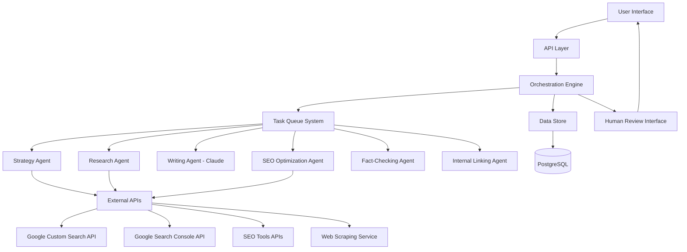

# Design Document: AI SEO Writer

## Overview

The AI SEO Writer is a sophisticated multi-agent system built on Next.js App Router that automates the entire SEO content creation process. It leverages Google Gemini AI for search and research capabilities, Claude Sonnet for high-quality content writing, and integrates with various external APIs for comprehensive SEO analysis and content optimization.

This document outlines the technical architecture, components, data models, and integration points required to implement the system according to the requirements.

## Architecture

The system follows a microservices-oriented architecture with a central orchestration layer managing multiple specialized AI agents. Each agent is responsible for specific tasks within the content creation workflow.

### High-Level Architecture



### System Components

1. **Next.js App Router Frontend**
   - Dashboard for project management
   - Content review and approval interfaces
   - Progress monitoring and reporting
   - User authentication and project settings

2. **API Layer (tRPC)**
   - Type-safe API endpoints for all system operations
   - Authentication and authorization
   - Rate limiting and request validation

3. **Orchestration Engine**
   - Central coordinator for all agent activities
   - Workflow management and state tracking
   - Error handling and recovery strategies
   - Human-in-the-loop integration points

4. **Task Queue System**
   - Distributed job queue for agent tasks
   - Priority-based scheduling
   - Retry logic with exponential backoff
   - Event-driven task triggering

5. **Agent Framework**
   - Common infrastructure for all AI agents
   - Standardized input/output formats
   - Agent communication protocols
   - Performance monitoring and logging

6. **Specialized Agents**
   - Website Analysis Agent (Gemini Pro)
   - Strategy Agent (Gemini Pro)
   - Research Agent (Gemini with grounding)
   - Writing Agent (Claude Sonnet)
   - SEO Optimization Agent
   - Fact-Checking Agent
   - Internal Linking Agent
   - Plan Adjustment Agent

7. **External API Integration Layer**
   - Google Custom Search API connector
   - Google Search Console API connector
   - SEO Tools API connectors (Ahrefs, SEMrush, etc.)
   - Web scraping service

8. **Data Store**
   - PostgreSQL database for structured data
   - Document storage for content artifacts
   - Caching layer for API responses

## Components and Interfaces

### 1. User Interface Components

#### Dashboard
- Project creation and management
- Workflow status visualization
- Content review and approval interfaces
- Settings and configuration

#### Content Editor
- Article preview and editing
- Revision history
- SEO score visualization
- Publishing interface

#### Analytics Dashboard
- Content performance metrics
- SEO ranking tracking
- Traffic and conversion analytics
- Keyword position monitoring

### 2. Agent Components

#### Website Analysis Agent
- **Purpose**: Analyze website content and generate article settings
- **Inputs**: Website URL, user preferences
- **Outputs**: Article settings configuration
- **Technologies**: Google Gemini Pro, web scraping
- **Key Methods**:
  - `analyzeWebsite(url: string): WebsiteAnalysis`
  - `extractWebsiteMetadata(analysis: WebsiteAnalysis): WebsiteMetadata`
  - `identifyTargetAudience(analysis: WebsiteAnalysis): AudienceProfile`
  - `generateArticleSettings(metadata: WebsiteMetadata, audience: AudienceProfile): ArticleSettings`

#### Strategy Agent
- **Purpose**: Generate comprehensive SEO strategies
- **Inputs**: Topic/niche, target audience, business goals
- **Outputs**: Keyword analysis, competitor insights, content plan
- **Technologies**: Google Gemini Pro, Google Search Console API
- **Key Methods**:
  - `analyzeKeywords(topic: string): KeywordAnalysis`
  - `analyzeCompetitors(keywords: string[]): CompetitorAnalysis`
  - `generateTopicTree(analysis: Analysis): TopicTree`
  - `testTopicDemand(topics: Topic[]): DemandAnalysis`

#### Research Agent
- **Purpose**: Gather comprehensive information on topics
- **Inputs**: Topics, keywords, research questions
- **Outputs**: Research findings, sources, data points
- **Technologies**: Google Gemini with grounding, web scraping
- **Key Methods**:
  - `researchTopic(topic: Topic): ResearchFindings`
  - `validateInformation(findings: ResearchFindings): ValidationResult`
  - `compileSources(findings: ResearchFindings): SourceList`

#### Writing Agent
- **Purpose**: Generate high-quality article drafts
- **Inputs**: Research findings, content brief, style guide
- **Outputs**: Article drafts, headlines, meta descriptions
- **Technologies**: Claude Sonnet
- **Key Methods**:
  - `generateOutline(brief: ContentBrief): ContentOutline`
  - `writeArticle(outline: ContentOutline, research: ResearchFindings): ArticleDraft`
  - `generateHeadlines(topic: Topic, keywords: string[]): Headline[]`

#### SEO Optimization Agent
- **Purpose**: Enhance content for search rankings
- **Inputs**: Article draft, target keywords, SEO guidelines
- **Outputs**: Optimized content, SEO recommendations
- **Technologies**: Gemini Pro, SEO tools APIs
- **Key Methods**:
  - `optimizeContent(draft: ArticleDraft, keywords: string[]): OptimizedContent`
  - `suggestImprovements(content: Content, seoAnalysis: SEOAnalysis): Recommendations`

#### Fact-Checking Agent
- **Purpose**: Verify factual accuracy of content
- **Inputs**: Article content, research findings
- **Outputs**: Fact-check report, correction suggestions
- **Technologies**: Gemini with grounding
- **Key Methods**:
  - `checkFacts(content: Content, sources: SourceList): FactCheckReport`
  - `identifyQuestionableClaims(content: Content): ClaimList`

#### Internal Linking Agent
- **Purpose**: Add relevant internal links to content
- **Inputs**: Article content, site structure, existing content
- **Outputs**: Content with internal links
- **Technologies**: Gemini Pro
- **Key Methods**:
  - `analyzeContentForLinkOpportunities(content: Content, siteMap: SiteMap): LinkOpportunities`
  - `insertInternalLinks(content: Content, opportunities: LinkOpportunities): EnhancedContent`

#### Plan Adjustment Agent
- **Purpose**: Modify workflows when issues arise
- **Inputs**: Error reports, task status, system constraints
- **Outputs**: Modified plans, alternative approaches
- **Technologies**: Gemini Pro
- **Key Methods**:
  - `identifyBlockers(taskStatus: TaskStatus[]): Blockers`
  - `generateAlternativePlans(blockers: Blockers): AlternativePlans`

### 3. External API Interfaces

#### Google Custom Search API
- **Purpose**: Perform web searches for research
- **Endpoints**:
  - `GET https://www.googleapis.com/customsearch/v1`
- **Authentication**: API Key
- **Rate Limits**: 100 queries/day free, then $5 per 1000 queries

#### Google Search Console API
- **Purpose**: Access search performance data and keyword insights
- **Endpoints**:
  - `GET https://www.googleapis.com/webmasters/v3/sites/{siteUrl}/searchAnalytics/query`
- **Authentication**: OAuth 2.0
- **Rate Limits**: 2000 queries/day

#### SEO Tools APIs
- **Options**:
  - SEMrush API
  - Ahrefs API
  - Moz API
- **Key Functionality**:
  - Keyword difficulty analysis
  - Backlink data
  - SERP analysis
  - Content gap analysis

#### Web Scraping Service
- **Purpose**: Extract content from competitor websites
- **Implementation Options**:
  - Custom scraping service with Puppeteer/Playwright
  - Third-party services like ScrapingBee or Bright Data
- **Features**:
  - JavaScript rendering
  - CAPTCHA handling
  - IP rotation
  - Rate limiting

## Data Models

### Project
```typescript
interface Project {
  id: string;
  name: string;
  description: string;
  status: 'planning' | 'in_progress' | 'review' | 'completed';
  createdAt: Date;
  updatedAt: Date;
  userId: string;
  websiteUrl?: string;
  settings: ProjectSettings;
  articleSettings: ArticleSettings;
}

interface ProjectSettings {
  targetAudience: string[];
  contentGoals: string[];
  brandVoice: string;
  preferredSources: string[];
  excludedSources: string[];
  humanReviewSteps: ('strategy' | 'headlines' | 'outline' | 'draft' | 'final')[];
}

interface ArticleSettings {
  // Website Information
  productName: string;
  websiteType: string;
  websiteSummary: string;
  blogTheme: string;
  founders?: string;
  keyFeatures?: string[];
  pricingPlans?: string;
  
  // Target Audience
  primaryTargetCountry: string;
  primaryLanguage: string;
  targetAudienceSummary: string;
  painPoints?: string[];
  productUsage?: string;
  
  // Competitors
  competitorsToExclude?: string[];
  competitorWebsitesToExclude?: string[];
  competitorYouTubeChannelsToExclude?: string[];
  
  // Content Style
  brandingTheme?: string;
  languageStyleExamples?: string[];
  
  // Content Structure
  outlineRequirements?: string;
  introductionRequirements?: string;
  articleSectionRequirements?: string;
  metadataRequirements?: string;
  imagePromptRequirements?: string;
  
  // Call to Action
  ctaType?: string;
  ctaTitle?: string;
  ctaDescription?: string;
  ctaButtonUrl?: string;
  ctaButtonText?: string;
  ctaNote?: string;
}
```

### SEO Strategy
```typescript
interface SEOStrategy {
  id: string;
  projectId: string;
  mainTopic: string;
  keywordAnalysis: KeywordAnalysis;
  competitorAnalysis: CompetitorAnalysis;
  topicTree: TopicTree;
  demandAnalysis: DemandAnalysis;
  createdAt: Date;
  updatedAt: Date;
  status: 'draft' | 'approved' | 'rejected';
  humanFeedback?: string;
}

interface KeywordAnalysis {
  primaryKeywords: Keyword[];
  secondaryKeywords: Keyword[];
  longTailKeywords: Keyword[];
  relatedQueries: string[];
}

interface Keyword {
  term: string;
  searchVolume: number;
  difficulty: number;
  cpc: number;
  competition: number;
}

interface CompetitorAnalysis {
  competitors: Competitor[];
  contentGaps: ContentGap[];
  commonTopics: string[];
}

interface Competitor {
  domain: string;
  strengths: string[];
  weaknesses: string[];
  topPerformingContent: ContentItem[];
}

interface TopicTree {
  mainTopic: string;
  branches: TopicBranch[];
}

interface TopicBranch {
  topic: string;
  subtopics: string[];
  keywords: string[];
  questions: string[];
}

interface DemandAnalysis {
  topicDemandScores: {[topic: string]: number};
  recommendedPriorities: string[];
  seasonalTrends: {[topic: string]: string[]};
}
```

### Task
```typescript
interface Task {
  id: string;
  projectId: string;
  parentTaskId?: string;
  type: TaskType;
  status: 'pending' | 'in_progress' | 'completed' | 'failed';
  priority: 'low' | 'medium' | 'high' | 'critical';
  assignedAgent: string;
  input: any;
  output?: any;
  error?: string;
  retryCount: number;
  createdAt: Date;
  updatedAt: Date;
  completedAt?: Date;
}

type TaskType = 
  | 'keyword_analysis'
  | 'competitor_analysis'
  | 'topic_research'
  | 'outline_creation'
  | 'content_writing'
  | 'fact_checking'
  | 'seo_optimization'
  | 'internal_linking'
  | 'human_review';
```

### Content
```typescript
interface Content {
  id: string;
  projectId: string;
  title: string;
  metaDescription: string;
  outline: ContentOutline;
  draft: string;
  optimizedContent: string;
  factCheckReport: FactCheckReport;
  seoScore: number;
  internalLinks: InternalLink[];
  sources: Source[];
  status: 'draft' | 'review' | 'approved' | 'published';
  createdAt: Date;
  updatedAt: Date;
}

interface ContentOutline {
  title: string;
  sections: Section[];
}

interface Section {
  heading: string;
  subheadings?: string[];
  keyPoints: string[];
  targetKeywords: string[];
}

interface InternalLink {
  anchorText: string;
  url: string;
  context: string;
}

interface Source {
  url: string;
  title: string;
  author?: string;
  publishDate?: Date;
  accessDate: Date;
  reliability: 'high' | 'medium' | 'low';
}

interface FactCheckReport {
  verifiedClaims: Claim[];
  questionableClaims: Claim[];
  missingCitations: string[];
}

interface Claim {
  statement: string;
  location: string;
  verificationStatus: 'verified' | 'questionable' | 'false';
  sources?: Source[];
  suggestedCorrection?: string;
}
```

## Error Handling

### Error Types
1. **API Errors**
   - Rate limiting
   - Authentication failures
   - Service unavailability
   - Malformed responses

2. **Agent Errors**
   - Model failures
   - Hallucinations
   - Timeout issues
   - Context limitations

3. **Task Execution Errors**
   - Task dependencies failures
   - Resource constraints
   - Invalid inputs
   - Business logic errors

### Error Handling Strategies

1. **Retry Logic**
   - Exponential backoff for transient errors
   - Circuit breaker pattern for persistent failures
   - Fallback mechanisms for critical paths

2. **Graceful Degradation**
   - Alternative data sources when primary sources fail
   - Simplified processing when full processing is impossible
   - Human intervention triggers for critical failures

3. **Monitoring and Alerting**
   - Real-time error tracking
   - Performance monitoring
   - Anomaly detection
   - Critical failure notifications

4. **Recovery Mechanisms**
   - Task state persistence
   - Checkpoint-based recovery
   - Transaction management
   - Compensating actions for partial failures

## Testing Strategy

### Unit Testing
- Test individual agent functions
- Mock external API responses
- Validate data transformations
- Test error handling logic

### Integration Testing
- Test agent interactions
- Validate workflow transitions
- Test database operations
- Test API integrations with mocked responses

### System Testing
- End-to-end workflow testing
- Performance testing under load
- Resilience testing with simulated failures
- Security testing

### AI-Specific Testing
- Model output validation
- Hallucination detection
- Prompt effectiveness testing
- Cross-validation between different models

### User Acceptance Testing
- Human review of generated content
- Workflow usability testing
- Dashboard functionality testing
- Approval process validation