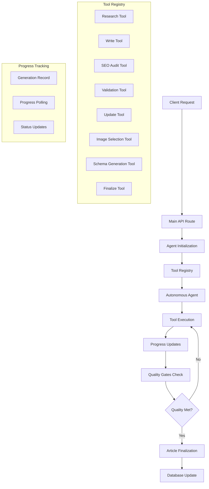

# Design Document

## Overview

The AI Agent Article Generation system replaces the current orchestrator-based approach with a single autonomous agent that uses Vercel AI SDK's `generateText` with tools and `maxSteps`. The agent intelligently progresses through research, writing, validation, and optimization phases while providing real-time progress tracking. The system maintains quality gates to ensure only high-quality, SEO-optimized articles are completed.

## Architecture

### Core Design Principles

- **Single Agent Mode**: Pure autonomous agent using `generateText` with tools - no orchestrator patterns
- **Tool-Based Execution**: Agent decides which tools to use and when based on context and quality gates
- **Inline Implementation**: No unnecessary abstractions or helper files - all logic within tools
- **Progress Persistence**: State persisted after each tool execution for UI feedback
- **Quality-Driven Completion**: Agent stops automatically when all quality criteria are met

### System Components



### Agent Flow

The agent follows this autonomous decision-making process:

1. **Initialization**: Agent receives article context and quality requirements
2. **Tool Selection**: Agent chooses appropriate tools based on current state
3. **Execution**: Tools execute with progress updates and result storage
4. **Quality Assessment**: Agent evaluates if quality gates are met
5. **Iteration**: Agent continues with corrections if needed
6. **Completion**: Agent finalizes when all criteria satisfied

## Components and Interfaces

### 1. Main API Route (`src/app/api/articles/generate/route.ts`)

**Purpose**: Single endpoint for autonomous article generation

**Key Responsibilities**:
- User authentication and project validation
- Generation record creation and management
- Agent initialization with tool registry
- Asynchronous execution handling
- Error management and cleanup

**Interface**:
```typescript
interface ArticleGenerationRequest {
  articleId: string;
  forceRegenerate?: boolean;
}

interface ArticleGenerationResponse {
  success: boolean;
  data?: { articleId: string };
  error?: string;
}
```

### 2. Tool Registry (`src/lib/ai/tools/registry.ts`)

**Purpose**: Centralized tool definitions with shared context

**Key Features**:
- All tools in single file for maintainability
- Shared context (articleId, projectId, userId, etc.)
- Progress update utilities
- Model selection per tool type

**Tool Interface**:
```typescript
interface ToolContext {
  articleId: number;
  projectId: number;
  generationId: number;
  userId: string;
  article: ArticleRecord;
}

interface ToolDefinition {
  description: string;
  parameters: ZodSchema;
  execute: (params: any) => Promise<any>;
}
```

### 3. Progress Tracking System

**Components**:
- **Generation Record**: `article_generation` (use existing columns listed below)
- **Progress API**: Reuse existing endpoint `src/app/api/articles/[id]/generation-status/route.ts` (poll by articleId)
- **Client Hook**: Reuse `src/hooks/use-generation-polling.ts` (set interval ~2000ms in UI)

**Progress States**:
- `initializing` (0%)
- `research` (10-25%)
- `writing` (30-60%)
- `seo-audit` (70-75%)
- `validation` (80-85%)
- `updating` (90-95%)
- `image-selection` (94-95%)
- `schema-generation` (97-98%)
- `finalizing` (99%)
- `completed` (100%)

### 4. Quality Gates System

**Quality Criteria**:
```typescript
interface QualityGates {
  seoScore: number; // >= 90
  seoIssues: Issue[]; // No CRITICAL/HIGH issues
  factAccuracy: number; // >= 8/10
  linkValidation: boolean; // All links working
  contentStructure: boolean; // Proper H1, H2s, conclusion
  schemaMarkup: boolean; // Valid JSON-LD
  coverImage: boolean; // Image selected with alt text
  metaOptimization: boolean; // Title/description optimized
}
```

## Data Models

### Article Generation: Existing Columns Used

No new columns are required. Use these existing fields on `article_generation`:

- `currentPhase` (DB: `current_phase`): detailed phase like `seo-audit`, `image-selection`, etc.
- `lastUpdated` (DB: `last_updated`): timestamp for progress updates.
- `metaVariants` (DB: `meta_variants`): meta title/description variants.
- `externalLinksUsed` (DB: `external_links_used`): string[] of external links.
- `headingsOutline` (DB: `headings_outline`): outline with headings/keywords.
- `seoReport` (DB: `seo_report`): JSON report with score/issues.
- `validationReport2` (DB: `validation_report_2`): JSON fact-check report.
- `linkIssues` (DB: `link_issues`): link validation issues.
- `schemaJson` (DB: `schema_json`): generated JSON-LD (stringified).
- `coverImageUrl2` (DB: `cover_image_url_2`): selected cover image URL.
- `coverImageAlt2` (DB: `cover_image_alt_2`): generated alt text.

Note: Coarse process `status` remains one of: `pending`, `researching`, `writing`, `quality-control`, `validating`, `updating`, `completed`, `failed`. Use `currentPhase` for finer-grained states.

### Tool Result Schemas

```typescript
// Research Tool Result
interface ResearchResult {
  mainFindings: string;
  sources: Array<{
    url: string;
    title: string;
    relevance: number;
    keyPoints: string[];
  }>;
  serpAnalysis: {
    topResults: Array<{
      title: string;
      url: string;
      headings?: string[];
    }>;
    peopleAlsoAsk?: string[];
    entities?: string[];
  };
  competitorGaps: string[];
  contentOpportunities: string[];
}

// Write Tool Result
interface WriteResult {
  content: string;
  metaVariants: Array<{
    title: string;
    description: string;
    score: number;
  }>;
  headingsOutline: Array<{
    level: number;
    text: string;
    keywords: string[];
  }>;
  externalLinks: Array<{
    url: string;
    anchor: string;
    relevance: string;
  }>;
  internalLinkOpportunities: string[];
}

// SEO Audit Result
interface SEOAuditResult {
  score: number; // 0-100
  issues: Array<{
    ruleId: string;
    severity: 'CRITICAL' | 'HIGH' | 'MEDIUM' | 'LOW';
    message: string;
    fix?: string;
  }>;
  keywordAnalysis: {
    primaryKeywordDensity: number;
    keywordDistribution: string;
    semanticCoverage: number;
  };
  readabilityScore: number;
  recommendations: string[];
}
```

## Error Handling

### Error Categories and Responses

1. **Authentication Errors**: Return 401 with clear message
2. **Validation Errors**: Return 400 with specific field errors
3. **Resource Not Found**: Return 404 with resource type
4. **Generation Failures**: Update generation record with error details
5. **Tool Failures**: Log error but allow agent to continue/retry

### Error Recovery Strategies

```typescript
// Tool-level error handling
try {
  const result = await performOperation();
  await updateProgress(progress, phase, { data: result });
  return result;
} catch (error) {
  console.error(`Tool ${toolName} failed:`, error);
  // Return error info for agent decision-making
  return { 
    error: error.message, 
    retry: shouldRetry(error),
    fallback: getFallbackData()
  };
}
```

### Graceful Degradation

- **Research Failure**: Use basic keyword research
- **Image Selection Failure**: Continue without cover image
- **SEO Audit Failure**: Skip optimization step
- **Validation Failure**: Proceed with content as-is
- **Quality Control Failure**: Use fallback validation

## Testing Strategy

### Unit Testing

**Tool Testing**:
```typescript
describe('Research Tool', () => {
  it('should extract sources from research data', async () => {
    const mockContext = createMockToolContext();
    const result = await researchTool.execute({
      topic: 'AI in healthcare',
      keywords: ['artificial intelligence', 'healthcare'],
      depth: 'comprehensive'
    });
    
    expect(result.sources).toHaveLength(greaterThan(0));
    expect(result.mainFindings).toBeDefined();
  });
});
```

**Quality Gates Testing**:
```typescript
describe('Quality Gates', () => {
  it('should pass when all criteria met', () => {
    const state = createMockGenerationState({
      seoScore: 95,
      factAccuracy: 9,
      allLinksWorking: true
    });
    
    expect(qualityGatesMet(state)).toBe(true);
  });
});
```

### Integration Testing

**End-to-End Agent Flow**:
```typescript
describe('Agent Generation Flow', () => {
  it('should complete full article generation', async () => {
    const response = await request(app)
      .post('/api/articles/generate')
      .send({ articleId: '123' });
    
    expect(response.status).toBe(200);
    expect(response.body.success).toBe(true);
    expect(response.body.data.articleId).toBe('123');
    
    // Poll for completion by articleId
    await waitForCompletionByArticle('123');
    
    // Verify final article state
    const article = await getArticle('123');
    expect(article.status).toBe('wait_for_publish');
    expect(article.draft).toBeDefined();
  });
});
```

### Performance Testing

**Metrics to Track**:
- Generation success rate (target: >95%)
- Average completion time (target: <10 minutes)
- Quality gate achievement rate (target: >90%)
- Tool failure recovery rate (target: >80%)
- Cost per article (target: <$2.00)

### Load Testing

**Concurrent Generation Testing**:
```typescript
describe('Concurrent Generations', () => {
  it('should handle multiple simultaneous generations', async () => {
    const promises = Array.from({ length: 10 }, (_, i) => 
      generateArticle({ articleId: `test-${i}` })
    );
    
    const results = await Promise.allSettled(promises);
    const successful = results.filter(r => r.status === 'fulfilled');
    
    expect(successful.length).toBeGreaterThan(8); // 80% success rate
  });
});
```

## Security Considerations

### Authentication and Authorization

- **User Verification**: Clerk authentication required for all requests
- **Project Ownership**: Verify user owns target project before generation
- **Resource Isolation**: Ensure project-based data isolation throughout process

### Data Protection

- **Input Sanitization**: Validate and sanitize all user inputs
- **Output Filtering**: Remove sensitive information from error messages
- **API Key Security**: Secure storage and rotation of external API keys

### Rate Limiting

```typescript
// Per-user generation limits
const RATE_LIMITS = {
  CONCURRENT_GENERATIONS: 3, // Max simultaneous generations per user
  DAILY_GENERATIONS: 50,     // Max generations per day
  HOURLY_GENERATIONS: 10     // Max generations per hour
};
```

## Performance Optimization

### Model Selection Strategy

```typescript
const MODEL_USAGE = {
  research: MODELS.GEMINI_2_5_FLASH,      // Fast, good for search integration
  writing: MODELS.CLAUDE_SONET_4,         // High quality content generation
  seoAudit: MODELS.GEMINI_2_5_FLASH,      // Fast analysis
  validation: MODELS.GEMINI_2_5_FLASH,    // Fact-checking with search
  updating: MODELS.CLAUDE_SONET_4         // Precise content editing
};
```

### Caching Strategy

- **Research Results**: Cache SERP data for 24 hours
- **Image Search**: Cache Unsplash results for 1 hour
- **SEO Rules**: Cache audit rules for 1 week
- **User Settings**: Cache project settings for 1 hour

### Database Optimization

```sql
-- Indexes for performance
CREATE INDEX CONCURRENTLY IF NOT EXISTS idx_article_generation_status 
ON article_generation (status, created_at);

CREATE INDEX CONCURRENTLY IF NOT EXISTS idx_article_generation_project_status 
ON article_generation (project_id, status);
```

## Monitoring and Observability

### Metrics Collection

```typescript
interface GenerationMetrics {
  generationId: number;
  userId: string;
  projectId: number;
  startTime: Date;
  endTime?: Date;
  status: 'completed' | 'failed';
  toolsUsed: string[];
  totalSteps: number;
  qualityScore: number;
  costUSD: number;
  errorCategory?: string;
}
```

### Logging Strategy

```typescript
// Structured logging for agent decisions
console.log('AGENT_DECISION', {
  generationId,
  currentPhase,
  toolSelected,
  reasoning,
  qualityGatesStatus,
  nextAction
});

// Performance logging
console.log('TOOL_PERFORMANCE', {
  toolName,
  executionTimeMs,
  inputSize,
  outputSize,
  success: true
});
```

### Alerting

- **High Failure Rate**: >10% failures in 1 hour
- **Long Generation Time**: >15 minutes per article
- **Quality Gate Failures**: >20% not meeting quality standards
- **Cost Anomalies**: >$5 per article generation

## Migration Strategy

### Phase 1: Infrastructure Setup (Week 1)
- Create enhanced database schema
- Implement tool registry framework
- Set up progress tracking system
- Create basic agent structure

### Phase 2: Core Tools Implementation (Week 2)
- Implement research, write, and validation tools
- Add SEO audit and update capabilities
- Integrate image selection and schema generation
- Test individual tool functionality

### Phase 3: Agent Integration (Week 3)
- Connect tools to autonomous agent
- Implement quality gates system
- Add error handling and recovery
- Test end-to-end generation flow

### Phase 4: Migration and Optimization (Week 4)
- Gradually migrate from orchestrator to agent
- Monitor performance and adjust parameters
- Optimize model selection and prompts
- Full production deployment

### Rollback Plan

- **Feature Flag**: Control agent vs orchestrator usage
- **Database Compatibility**: Maintain backward compatibility
- **Monitoring**: Real-time success rate monitoring
- **Quick Revert**: Ability to switch back within 5 minutes
