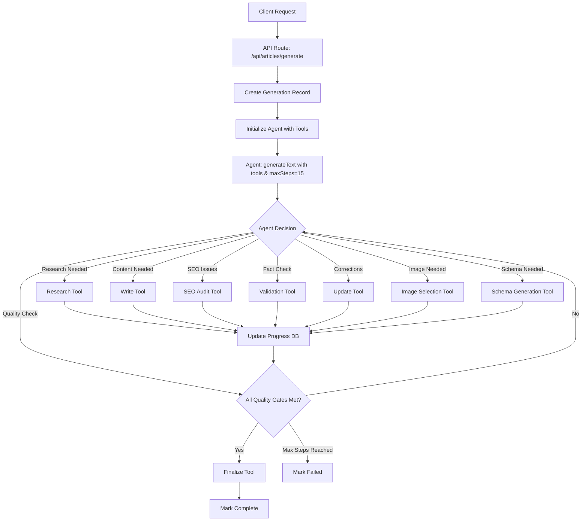

# AI Agent Article Generation - Implementation Plan

## How the AI Agent Works

### Architecture Overview

This implementation replaces the current orchestrator-based article generation with a **single autonomous AI agent** using Vercel AI SDK's `generateText` with tools and `maxSteps`. The agent operates completely autonomously, making intelligent decisions about which tools to use and when to stop based on quality gates.

### Core Agent Flow



### Key Components

#### 1. **Single API Endpoint** (`src/app/api/articles/generate/route.ts`)
- **Input**: `{ articleId, projectId }`
- **Authentication**: Clerk user auth + project ownership verification
- **Agent Initialization**: Creates tool registry with shared context
- **Execution**: Runs `generateText` with tools asynchronously
- **Response**: `{ success: true, data: { articleId } }` (for polling)

#### 2. **Tool Registry** (`src/lib/ai/tools/registry.ts`)
All 8 tools in ONE file with shared context:

```typescript
interface ToolContext {
  articleId: number;
  projectId: number; 
  generationId: number;
  userId: string;
  article: ArticleRecord;
}
```

**Tools Available**:
- **Research Tool**: Google Search + SERP analysis + competitor gaps
- **Write Tool**: Content generation using Claude Sonnet 4
- **SEO Audit Tool**: Comprehensive SEO scoring + issue detection  
- **Validation Tool**: Fact-checking + external link verification
- **Update Tool**: Apply corrections with minimal changes
- **Image Selection Tool**: Pexels/Unsplash + alt text generation
- **Schema Generation Tool**: JSON-LD Article schema markup
- **Finalize Tool**: Quality gates check + article completion

#### 3. **Progress Tracking**
- **Database**: Uses existing `article_generation` table fields
- **Real-time Updates**: Each tool execution updates progress/phase
- **Polling**: Client polls via existing `/api/articles/[id]/generation-status`
- **Phases**: `research` → `writing` → `seo-audit` → `validation` → `updating` → `image-selection` → `schema-generation` → `finalizing` → `completed`

#### 4. **Quality Gates System**
Agent **automatically stops** when ALL criteria met:

```typescript
const qualityGatesMet = () => {
  return (
    seoReport.score >= 90 &&
    !seoReport.issues.some(i => i.severity === 'CRITICAL' || i.severity === 'HIGH') &&
    validationReport.overallAccuracy >= 8 &&
    linkIssues.length === 0 &&
    draftContent.length > 800 &&
    hasProperHeadings &&
    schemaJson.length > 0 &&
    coverImageUrl.length > 0 &&
    metaVariants.length > 0
  );
};
```

### Agent Decision-Making

The agent uses this **system prompt logic**:

1. **Goal**: Create high-quality, SEO-optimized article meeting all quality standards
2. **Process**: Research → Write → Validate → Optimize → Finalize
3. **Decision Making**: Agent chooses tools based on current state and missing requirements
4. **Quality-Driven**: Continues iterating until all quality gates pass
5. **Autonomous Stopping**: No manual intervention - stops when criteria met

### Example Agent Execution Flow

```
Step 1: Agent → Research Tool
- Google search for topic
- Analyze SERP results  
- Identify content gaps
- Store research data

Step 2: Agent → Write Tool  
- Generate comprehensive content
- Create proper heading structure
- Add external links
- Generate meta variants

Step 3: Agent → SEO Audit Tool
- Analyze keyword optimization
- Check content structure
- Score readability
- Identify issues

Step 4: Agent → Validation Tool
- Fact-check all claims
- Verify external links
- Generate accuracy score

Step 5: Agent → Update Tool (if needed)
- Apply SEO fixes
- Correct factual errors
- Improve readability

Step 6: Agent → Image Selection Tool
- Search for relevant images
- Generate alt text
- Update article record

Step 7: Agent → Schema Generation Tool
- Create JSON-LD markup
- Validate schema structure

Step 8: Agent → Quality Gates Check
- All criteria met? → STOP
- Missing requirements? → Continue with more tools
```

### Error Handling & Recovery

- **Tool Failures**: Return error objects (don't throw) - agent decides whether to retry or continue
- **Graceful Degradation**: Missing images/schema won't fail entire generation
- **Progress Persistence**: All progress saved to DB for monitoring/debugging
- **Max Steps Protection**: Agent stops after 15 steps to prevent infinite loops

### Development Benefits

1. **Maintainable**: All tools in one file, no complex orchestration
2. **Debuggable**: Every agent decision and tool execution is logged
3. **Testable**: Individual tools can be unit tested in isolation
4. **Scalable**: Agent handles complexity internally, simple API interface
5. **Quality-Focused**: Built-in quality gates ensure consistent output

---

## Implementation Plan (Aligned with Current Repo)

- [ ] 0. Analysis Phase
  - Document reusable code in existing services
  - Map current API integrations and authentication patterns
  - Analyze current database schema and data patterns
  - Document current progress tracking implementation
  - Identify critical business logic to preserve
  - _Requirements: All_

- [ ] 1. Database Schema Cleanup
  - [ ] 1.1 Create database migration to clean up redundant columns
    - Remove `validationReport` (text) and keep `validationReport2` (jsonb) renamed to `validationReport`
    - Remove `coverImageUrl2` and `coverImageAlt2` from `article_generation` (use main article fields)
    - Consolidate duplicate fields to maintain single source of truth
    - Migrate any existing data from old columns to new ones
    - _Requirements: All_

- [ ] 2. Decisions and Conventions
  - Use articleId for progress polling via existing `src/app/api/articles/generation/[id]/status/route.ts`.
  - Standardize paths to `src/app/...` for API routes and `src/lib/...` for libraries.
  - Use existing DB fields on `article_generation`: `currentPhase`, `lastUpdated`, `metaVariants`, `externalLinksUsed`, `headingsOutline`, `seoReport`, `validationReport` (jsonb), `linkIssues`, `schemaJson`.
  - Use main `articles` table for: `coverImageUrl`, `coverImageAlt` (no duplication in generation table).
  - Model constants: use `MODELS.CLAUDE_SONNET_4` as defined in `src/constants.ts`.
  - Agent `maxSteps`: 15 (tune later if needed).

- [ ] 3. Single Tool Registry Implementation
  - [ ] 3.1 Create `src/lib/ai/tools/registry.ts` with ALL 8 tools in one file
    - Implement shared ToolContext interface with `articleId`, `projectId`, `generationId`, `userId`, `article`.
    - Add `updateProgress` utility that updates `article_generation` (`progress`, `currentPhase`, `lastUpdated`, plus any result fields).
    - Create research tool with Google Search integration and SERP analysis.
    - Create write tool using `MODELS.CLAUDE_SONNET_4` for high-quality content generation.
    - Create SEO audit tool with comprehensive keyword and structure analysis.
    - Create validation tool with fact-checking and link verification.
    - Create update tool for applying corrections with minimal changes.
    - Create image selection tool (Pexels/Unsplash) and alt text generation.
    - Create schema generation tool for JSON-LD Article markup.
    - Create finalize tool with quality gate validation and article completion.
    - _Requirements: 1.1, 1.2, 3.1, 3.2, 3.3, 3.4, 4.1, 4.2, 4.3, 4.4, 5.1, 5.2, 5.3, 5.4, 5.5, 6.1, 6.2, 6.3, 6.4, 6.5, 7.1, 7.2, 7.3, 7.4, 7.5, 9.1_

- [ ] 4. Quality Gates System Implementation
  - [ ] 4.1 Implement automatic quality validation with stopping criteria
    - Create `qualityGatesMet()` using existing generation fields:
      - SEO: from `seoReport.score` and ensure no `CRITICAL/HIGH` issues.
      - Facts: from `validationReport.overallAccuracy` and `criticalIssues`.
      - Links: ensure `linkIssues` is empty or only contains non-blocking.
      - Content: ensure `draftContent` length > 800 and proper headings present.
      - Schema: ensure `schemaJson` exists and parses.
      - Image: ensure main article `coverImageUrl` and `coverImageAlt` exist.
      - Meta: ensure `metaVariants` exist.
    - Agent stops automatically when all quality gates are met.
    - _Requirements: 8.1, 8.2, 8.3, 8.4, 8.5_

- [ ] 5. Autonomous Agent Implementation
  - [ ] 5.1 Replace orchestrator with single autonomous agent
    - COMPLETELY REPLACE all orchestrator logic in `src/app/api/articles/generate/route.ts`.
    - Implement agent using `generateText` with tools and `maxSteps: 15`.
    - Add comprehensive system prompt defining autonomous behavior and quality goals.
    - Include tool registry initialization with shared context.
    - Add user authentication and project ownership verification.
    - Create generation record with initial progress state.
    - Handle asynchronous execution with proper error handling and cleanup.
    - Response should include `{ success: true, data: { articleId } }` (polling uses articleId).
    - _Requirements: 1.1, 1.2, 1.3, 1.4, 1.5, 10.1, 10.2_

  - [ ] 5.2 Implement agent system prompt and decision-making logic
    - Create system prompt that defines agent goals, process flow, and quality gates.
    - Add agent decision-making logic for intelligent tool selection and iteration.
    - Implement quality-driven completion where agent stops when all criteria met.
    - Add error recovery strategies where tools return error objects without throwing.
    - Define tool usage patterns and optimization strategies.
    - _Requirements: 1.3, 1.4, 8.1, 8.2, 8.3, 8.4, 8.5_

- [ ] 6. Progress Tracking System
  - [ ] 6.1 Reuse existing progress polling API endpoint
    - Use `src/app/api/articles/[id]/generation-status/route.ts` for real-time status (by articleId).
    - Ensure it returns `progress`, `status`, `phase/currentStep`, `startedAt`, `completedAt`, `error`.
    - _Requirements: 2.1, 2.2, 2.3, 2.4, 10.3, 10.4_

  - [ ] 6.2 Client-side progress tracking
    - Reuse `src/hooks/use-generation-polling.ts` for UI updates; set interval to ~2000ms when used in UI.
    - Handle completion and error states appropriately.
    - Stop polling when generation completes or fails.
    - _Requirements: 2.1, 2.2, 2.4_

- [ ] 7. Error Handling and Recovery
  - [ ] 7.1 Implement comprehensive error handling in agent and tools
    - Add error categorization and recovery strategies for each tool.
    - Implement graceful degradation when tools fail (return error objects, don't throw).
    - Update generation record with detailed error information and context.
    - Reset article status appropriately on generation failure.
    - Add retry logic and fallback strategies for tool failures.
    - _Requirements: 1.5, 9.2, 9.3_

  - [ ] 7.2 Add monitoring and debugging capabilities
    - Implement structured logging for agent decisions and tool usage patterns.
    - Add performance metrics tracking (success rate, completion time, cost per article).
    - Create debugging visibility into agent decision-making process.
    - Track quality gate achievement rates for optimization.
    - Log tool execution times and model usage for cost analysis.
    - _Requirements: 9.1, 9.2, 9.3, 9.4, 9.5_

- [ ] 8. Testing and Validation
  - [ ] 8.1 Create unit tests for individual tools and quality gates
    - Write tests for each tool's parameter validation and execution logic.
    - Mock external API calls (Google Search, Pexels/Unsplash) for consistent testing.
    - Test error handling and fallback scenarios for each tool.
    - Validate progress update functionality and data storage.
    - Test quality gates validation logic with various scenarios.
    - Test tool registry creation and context sharing.
    - _Requirements: 1.1, 3.1, 4.1, 5.1, 6.1, 7.1, 8.1, 8.2, 8.3, 8.4, 8.5_

  - [ ] 8.2 Implement integration tests for agent workflow
    - End-to-end test for complete article generation flow via `src/app/api/articles/generate/route.ts`.
    - Test quality gate validation and agent stopping conditions.
    - Verify project context and user permission enforcement.
    - Test concurrent generation handling and resource isolation.
    - Test agent decision-making and tool selection logic.
    - Verify error recovery and graceful degradation.
    - Poll status via `src/app/api/articles/[id]/generation-status/route.ts`.
    - _Requirements: 1.2, 1.3, 1.4, 1.5, 8.1, 8.2, 8.3, 8.4, 8.5, 10.1, 10.2, 10.3_

- [ ] 9. Migration and Deployment
  - [ ] 9.1 Migration
    - Deploy new agent system
    - Monitor generation success rates and performance metrics
    - Document performance improvements
    - _Requirements: 1.1, 1.2, 9.4, 9.5_

  - [ ] 9.2 Validation and Stabilization
    - Compare quality metrics and success rates
    - Gather user feedback and satisfaction metrics
    - Fine-tune agent parameters based on data
    - _Requirements: 1.1, 1.2, 9.4, 9.5_

  - [ ] 9.3 Legacy Code Removal
    - Create backup branch of legacy code
    - Remove service files in `src/lib/services/` after successful validation
    - Clean up remaining orchestrator references
    - Update documentation to reflect new architecture
    - _Requirements: 1.1, 1.2_
