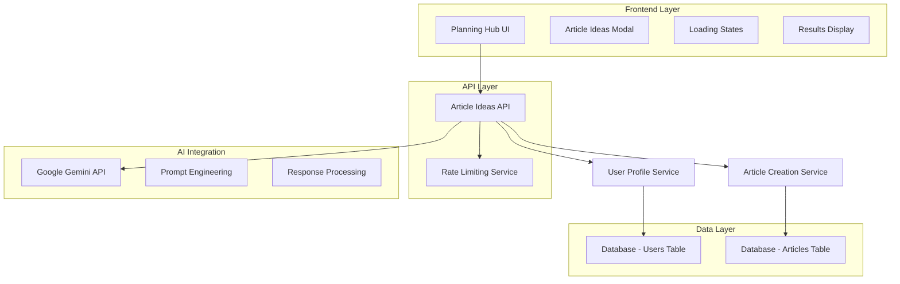

# Design Document

## Overview

The AI Article Idea Generator is a feature that integrates Google Gemini with grounding to provide intelligent article title suggestions based on user business context. The system uses a phased approach similar to the existing research prompt structure, leveraging user profile data to generate contextually relevant, SEO-optimized article ideas that align with the user's content strategy.

## Architecture

### System Components



### Request Flow

1. **User Interaction**: User clicks "Generate Article Ideas" button in Planning Hub
2. **Rate Limiting**: System checks user's recent generation requests
3. **Context Gathering**: System retrieves user profile data (domain, product_description, keywords)
4. **AI Processing**: System sends structured prompt to Google Gemini with grounding
5. **Response Processing**: System parses and validates AI response
6. **Result Display**: System presents 5 article ideas with add-to-pipeline functionality

## Components and Interfaces

### API Endpoint

**Route**: `POST /api/articles/generate-ideas`

**Request Interface**:
```typescript
interface GenerateIdeasRequest {
  // No body parameters - uses authenticated user context
}

interface GenerateIdeasResponse {
  success: boolean;
  ideas: ArticleIdea[];
  error?: string;
  rateLimitInfo: {
    remaining: number;
    resetTime: number;
  };
}

interface ArticleIdea {
  title: string;
  description: string;
  keywords: string[];
  targetAudience?: string;
  contentAngle: string; // e.g., "how-to", "listicle", "case-study"
  estimatedDifficulty: "beginner" | "intermediate" | "advanced";
}
```

### Frontend Components

**ArticleIdeasGenerator Component**:
```typescript
interface ArticleIdeasGeneratorProps {
  onIdeaAdded: (idea: ArticleIdea) => void;
  onClose: () => void;
}

interface ArticleIdeasGeneratorState {
  isGenerating: boolean;
  ideas: ArticleIdea[];
  error: string | null;
  rateLimitInfo: RateLimitInfo | null;
}

interface CachedIdeasData {
  ideas: ArticleIdea[];
  timestamp: number;
  userId: string; // Ensure cache is user-specific
}
```

**Local Storage Management**:
```typescript
interface LocalStorageManager {
  saveIdeas: (ideas: ArticleIdea[], userId: string) => void;
  loadIdeas: (userId: string) => ArticleIdea[] | null;
  clearIdeas: (userId: string) => void;
  isExpired: (timestamp: number) => boolean;
}
```

**Integration with Planning Hub**:
- Add "Generate Ideas" button next to "Add Article Idea"
- Modal overlay for idea generation and results
- Seamless integration with existing article creation flow

### Database Schema Extensions

No new database tables required. The feature uses existing:
- `users` table for profile data (domain, product_description, keywords)
- `articles` table for created ideas
- Existing rate limiting can be implemented in-memory or using Redis

## Data Models

### User Profile Context
```typescript
interface UserContext {
  domain: string;
  productDescription: string;
  keywords: string[];
  companyName?: string;
  existingArticleTitles: string[]; // To avoid duplicates
}
```

### AI Prompt Structure
The prompt follows the established pattern from the research prompt, with phases:

1. **Context Analysis Phase**: Analyze user business context
2. **Market Research Phase**: Research current trends in user's domain
3. **Idea Generation Phase**: Generate diverse article concepts
4. **SEO Optimization Phase**: Optimize titles and keywords
5. **Validation Phase**: Ensure ideas are actionable and relevant

### Response Processing
```typescript
interface AIResponse {
  ideas: {
    title: string;
    description: string;
    keywords: string[];
    rationale: string;
    contentType: string;
    difficulty: string;
  }[];
  analysisContext: {
    domainInsights: string;
    trendAnalysis: string;
    competitorGaps: string;
  };
}
```

## Error Handling

### Rate Limiting
- **Limit**: 5 requests per hour per user
- **Storage**: In-memory cache with user ID as key
- **Response**: HTTP 429 with retry-after header
- **UI Feedback**: Clear message with time until next allowed request

### API Errors
- **Gemini API Failures**: Retry logic with exponential backoff
- **Timeout Handling**: 30-second timeout with graceful degradation
- **Invalid Responses**: Validation and fallback to generic suggestions
- **Authentication Errors**: Redirect to login with context preservation

### User Experience Errors
- **Empty Profile Data**: Prompt user to complete onboarding
- **Network Issues**: Offline detection and retry mechanisms
- **Validation Failures**: Clear field-level error messages

## Testing Strategy

### Unit Tests
- **API Endpoint**: Request validation, response formatting, error handling
- **Prompt Engineering**: Template generation, context injection
- **Rate Limiting**: Limit enforcement, reset logic
- **Response Processing**: AI response parsing, validation

### Integration Tests
- **End-to-End Flow**: Button click → API call → Result display → Article creation
- **Database Integration**: User context retrieval, article creation
- **AI Integration**: Mock Gemini responses, error scenarios

### User Acceptance Tests
- **Happy Path**: Generate ideas → Add to pipeline → Verify in Planning Hub
- **Error Scenarios**: Rate limiting, API failures, network issues
- **Performance**: Response times, loading states, UI responsiveness

### Load Testing
- **Concurrent Users**: Multiple users generating ideas simultaneously
- **Rate Limit Stress**: Users hitting rate limits
- **API Performance**: Gemini API response times under load

## Security Considerations

### Authentication & Authorization
- **User Authentication**: Clerk-based auth required for all requests
- **User Context**: Only access authenticated user's profile data
- **API Key Security**: Gemini API key stored in environment variables

### Input Validation
- **User Profile Data**: Sanitize domain, product description inputs
- **Response Validation**: Validate AI responses before presenting to users
- **XSS Prevention**: Sanitize all user-generated content in UI

### Rate Limiting Security
- **Per-User Limits**: Prevent individual user abuse
- **IP-Based Limits**: Additional protection against distributed abuse
- **Monitoring**: Log suspicious patterns and repeated failures

## Performance Optimization

### Caching Strategy
- **User Context**: Cache user profile data for 5 minutes
- **Rate Limit Data**: In-memory cache with TTL
- **AI Responses**: Optional caching of similar requests (privacy considerations)

### Response Time Targets
- **API Response**: < 10 seconds for idea generation
- **UI Feedback**: Immediate loading state, progress updates every 2 seconds
- **Error Recovery**: < 1 second for error display and retry options

### Scalability Considerations
- **Async Processing**: Consider queue-based processing for high load
- **API Rate Limits**: Respect Gemini API rate limits and quotas
- **Database Performance**: Efficient queries for user context retrieval

## Monitoring and Analytics

### Metrics to Track
- **Usage Metrics**: Requests per hour, success rate, error rate
- **Performance Metrics**: Response times, API latency, timeout rate
- **User Behavior**: Ideas generated vs. ideas added to pipeline
- **Cost Metrics**: Gemini API usage and costs

### Alerting
- **High Error Rate**: > 5% error rate in 5-minute window
- **API Failures**: Gemini API unavailable or high latency
- **Rate Limit Abuse**: Users consistently hitting limits

### Logging
- **Request Logging**: User ID, timestamp, success/failure
- **Error Logging**: Detailed error context for debugging
- **Performance Logging**: Response times and bottlenecks