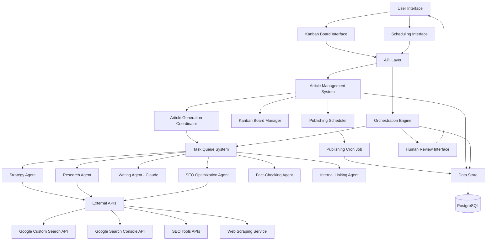
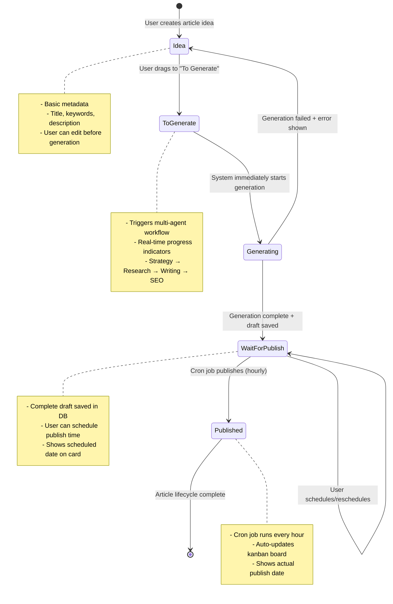

# Design Document: AI SEO Writer

## Overview

The AI SEO Writer is a sophisticated multi-agent system built on Next.js App Router that automates the entire SEO content creation process. It leverages Google Gemini AI for search and research capabilities, Claude Sonnet for high-quality content writing, and integrates with various external APIs for comprehensive SEO analysis and content optimization. The system uses Next.js API routes for all backend functionality, providing RESTful endpoints that handle authentication, data validation, and business logic without using tRPC. The system uses Next.js API routes for all backend functionality, providing RESTful endpoints that handle authentication, data validation, and business logic without using tRPC.

This document outlines the technical architecture, components, data models, and integration points required to implement the system according to the requirements.

## Architecture

The system follows a microservices-oriented architecture with a central orchestration layer managing multiple specialized AI agents. Each agent is responsible for specific tasks within the content creation workflow.

### High-Level Architecture



### Kanban Workflow Architecture



### System Components

1. **Next.js App Router Frontend**

   - Dashboard for project management
   - Kanban board for article workflow management
   - Content review and approval interfaces
   - Article scheduling and publishing interface
   - Progress monitoring and reporting
   - User authentication and project settings

2. **API Layer (Next.js API Routes)**

   - RESTful API endpoints for all system operations
   - Project management (CRUD operations)
   - Website analysis and article settings generation
   - Kanban board operations (create, move, update articles)
   - Article generation workflow management
   - Article scheduling and publishing endpoints
   - Task queue and job management
   - Authentication and authorization with Clerk
   - Rate limiting and request validation
   - JSON-based request/response handling
   - Zod schema validation for all inputs
   - Standardized error handling and response formats

3. **Kanban Board System**

   - Visual workflow management for articles
   - Drag-and-drop functionality for status changes
   - Real-time updates and synchronization
   - Article metadata and progress tracking
   - Integration with generation and publishing workflows

4. **Article Management System**

   - Article lifecycle management (Idea → To Generate → Wait for Publish → Published)
   - Draft storage and version control
   - Scheduling and publishing coordination
   - Metadata management and SEO optimization

5. **Orchestration Engine**

   - Central coordinator for all agent activities
   - Workflow management and state tracking
   - Error handling and recovery strategies
   - Human-in-the-loop integration points
   - Kanban status synchronization

6. **Task Queue System**

   - Distributed job queue for agent tasks
   - Priority-based scheduling
   - Retry logic with exponential backoff
   - Event-driven task triggering
   - Article generation workflow management

7. **Scheduling and Publishing System**

   - Cron job for automated publishing
   - Article scheduling management
   - Status transition automation
   - Publishing workflow coordination

8. **Agent Framework**

   - Common infrastructure for all AI agents
   - Standardized input/output formats
   - Agent communication protocols
   - Performance monitoring and logging

9. **Specialized Agents**

   - Website Analysis Agent (Gemini Pro)
   - Strategy Agent (Gemini Pro)
   - Research Agent (Gemini with grounding)
   - Writing Agent (Claude Sonnet)
   - SEO Optimization Agent
   - Fact-Checking Agent
   - Internal Linking Agent
   - Plan Adjustment Agent

10. **External API Integration Layer**

    - Google Custom Search API connector
    - Google Search Console API connector
    - SEO Tools API connectors (Ahrefs, SEMrush, etc.)
    - Web scraping service

11. **Data Store**
    - PostgreSQL database for structured data
    - Article drafts and content storage
    - Scheduling and status tracking
    - Document storage for content artifacts
    - Caching layer for API responses

## Components and Interfaces

### 1. Core Services Layer

#### Article Generation Service

- **Purpose**: Centralized service for orchestrating the complete article generation workflow
- **Key Methods**:
  - `generateArticle(articleId: number): Promise<GeneratedArticle>`
  - `getGenerationProgress(articleId: number): Promise<GenerationProgress>`
  - `cancelGeneration(articleId: number): Promise<void>`
- **Workflow Steps**:
  1. Research phase using existing research logic
  2. Content writing using existing write logic
  3. Fact validation using existing validate logic
  4. Content updates using existing update logic
  5. Final optimization and formatting

#### Research Service

- **Purpose**: Reusable research functionality extracted from `/research` route
- **Technologies**: Google Gemini with grounding
- **Key Methods**:
  - `conductResearch(title: string, keywords: string[]): Promise<ResearchResult>`
  - **Reuses**: Existing research route logic with Google search grounding

#### Writing Service

- **Purpose**: Reusable content writing functionality extracted from `/write` route
- **Technologies**: Claude Sonnet
- **Key Methods**:
  - `writeArticle(researchData: string, title: string, keywords: string[]): Promise<BlogPost>`
  - **Reuses**: Existing write route logic with blog post schema

#### Validation Service

- **Purpose**: Reusable fact-checking functionality extracted from `/validate` route
- **Technologies**: Google Gemini with grounding
- **Key Methods**:
  - `validateArticle(article: string): Promise<ValidationResult>`
  - **Reuses**: Existing validation route logic with structured response

#### Update Service

- **Purpose**: Reusable content correction functionality extracted from `/update` route
- **Technologies**: Claude Sonnet
- **Key Methods**:
  - `updateArticle(article: string, corrections: Correction[]): Promise<BlogPost>`
  - **Reuses**: Existing update route logic with corrections

#### Scheduling Service

- **Purpose**: Reusable scheduling functionality extracted from `/schedule` route
- **Key Methods**:
  - `scheduleArticle(articleId: number, scheduledAt: Date): Promise<void>`
  - `publishScheduledArticles(): Promise<PublishedArticle[]>`
  - **Reuses**: Existing schedule route logic with database operations

### 2. User Interface Components

#### Dashboard

- Project creation and management
- Workflow status visualization
- Content review and approval interfaces
- Settings and configuration

#### Content Editor

- Article preview and editing
- Revision history
- SEO score visualization
- Publishing interface

#### Kanban Board Interface

- Visual article workflow management
- Drag-and-drop functionality for status changes
- Article cards with metadata and progress indicators
- Real-time updates and collaboration features
- Filtering and search capabilities

#### Article Scheduling Interface

- Calendar view for scheduled articles
- Bulk scheduling operations
- Publishing time optimization suggestions
- Status tracking and notifications

#### Analytics Dashboard

- Content performance metrics
- SEO ranking tracking
- Traffic and conversion analytics
- Keyword position monitoring
- Article generation and publishing analytics

### 2. Agent Components

#### Website Analysis Agent

- **Purpose**: Analyze website content and generate article settings
- **Inputs**: Website URL, user preferences
- **Outputs**: Article settings configuration
- **Technologies**: Google Gemini Pro, web scraping
- **Key Methods**:
  - `analyzeWebsite(url: string): WebsiteAnalysis`
  - `extractWebsiteMetadata(analysis: WebsiteAnalysis): WebsiteMetadata`
  - `identifyTargetAudience(analysis: WebsiteAnalysis): AudienceProfile`
  - `generateArticleSettings(metadata: WebsiteMetadata, audience: AudienceProfile): ArticleSettings`

#### Strategy Agent

- **Purpose**: Generate comprehensive SEO strategies
- **Inputs**: Topic/niche, target audience, business goals
- **Outputs**: Keyword analysis, competitor insights, content plan
- **Technologies**: Google Gemini Pro, Google Search Console API
- **Key Methods**:
  - `analyzeKeywords(topic: string): KeywordAnalysis`
  - `analyzeCompetitors(keywords: string[]): CompetitorAnalysis`
  - `generateTopicTree(analysis: Analysis): TopicTree`
  - `testTopicDemand(topics: Topic[]): DemandAnalysis`

#### Research Agent

- **Purpose**: Gather comprehensive information on topics
- **Inputs**: Topics, keywords, research questions
- **Outputs**: Research findings, sources, data points
- **Technologies**: Google Gemini with grounding, web scraping
- **Key Methods**:
  - `researchTopic(topic: Topic): ResearchFindings`
  - `validateInformation(findings: ResearchFindings): ValidationResult`
  - `compileSources(findings: ResearchFindings): SourceList`

#### Writing Agent

- **Purpose**: Generate high-quality article drafts
- **Inputs**: Research findings, content brief, style guide
- **Outputs**: Article drafts, headlines, meta descriptions
- **Technologies**: Claude Sonnet
- **Key Methods**:
  - `generateOutline(brief: ContentBrief): ContentOutline`
  - `writeArticle(outline: ContentOutline, research: ResearchFindings): ArticleDraft`
  - `generateHeadlines(topic: Topic, keywords: string[]): Headline[]`

#### SEO Optimization Agent

- **Purpose**: Enhance content for search rankings
- **Inputs**: Article draft, target keywords, SEO guidelines
- **Outputs**: Optimized content, SEO recommendations
- **Technologies**: Gemini Pro, SEO tools APIs
- **Key Methods**:
  - `optimizeContent(draft: ArticleDraft, keywords: string[]): OptimizedContent`
  - `suggestImprovements(content: Content, seoAnalysis: SEOAnalysis): Recommendations`

#### Fact-Checking Agent

- **Purpose**: Verify factual accuracy of content
- **Inputs**: Article content, research findings
- **Outputs**: Fact-check report, correction suggestions
- **Technologies**: Gemini with grounding
- **Key Methods**:
  - `checkFacts(content: Content, sources: SourceList): FactCheckReport`
  - `identifyQuestionableClaims(content: Content): ClaimList`

#### Internal Linking Agent

- **Purpose**: Add relevant internal links to content
- **Inputs**: Article content, site structure, existing content
- **Outputs**: Content with internal links
- **Technologies**: Gemini Pro
- **Key Methods**:
  - `analyzeContentForLinkOpportunities(content: Content, siteMap: SiteMap): LinkOpportunities`
  - `insertInternalLinks(content: Content, opportunities: LinkOpportunities): EnhancedContent`

#### Plan Adjustment Agent

- **Purpose**: Modify workflows when issues arise
- **Inputs**: Error reports, task status, system constraints
- **Outputs**: Modified plans, alternative approaches
- **Technologies**: Gemini Pro
- **Key Methods**:
  - `identifyBlockers(taskStatus: TaskStatus[]): Blockers`
  - `generateAlternativePlans(blockers: Blockers): AlternativePlans`

### 3. Kanban Board Components

#### Kanban Board Manager

- **Purpose**: Manage article workflow and status transitions
- **Inputs**: Article status changes, user interactions
- **Outputs**: Updated article positions and statuses
- **Key Methods**:
  - `moveArticle(articleId: string, fromStatus: string, toStatus: string): Promise<void>`
  - `createArticleIdea(projectId: string, articleData: Partial<Article>): Promise<Article>`
  - `getKanbanBoard(projectId: string): Promise<KanbanColumn[]>`
  - `updateArticlePosition(articleId: string, position: number): Promise<void>`

#### Article Generation Coordinator

- **Purpose**: Coordinate the multi-agent article generation process
- **Inputs**: Article moved to "To Generate" status
- **Outputs**: Generated article draft and metadata
- **Key Methods**:
  - `startGeneration(articleId: string): Promise<ArticleGenerationJob>`
  - `trackGenerationProgress(jobId: string): Promise<ArticleGenerationJob>`
  - `handleGenerationCompletion(jobId: string, result: any): Promise<void>`
  - `handleGenerationFailure(jobId: string, error: string): Promise<void>`

#### Publishing Scheduler

- **Purpose**: Manage article scheduling and automated publishing
- **Inputs**: Scheduled publish times, cron job triggers
- **Outputs**: Published articles and status updates
- **Key Methods**:
  - `scheduleArticle(articleId: string, publishAt: Date): Promise<PublishingSchedule>`
  - `processScheduledArticles(): Promise<PublishingSchedule[]>`
  - `publishArticle(articleId: string): Promise<void>`
  - `updatePublishingStatus(scheduleId: string, status: string): Promise<void>`

### 3. External API Interfaces

#### Google Custom Search API

- **Purpose**: Perform web searches for research
- **Endpoints**:
  - `GET https://www.googleapis.com/customsearch/v1`
- **Authentication**: API Key
- **Rate Limits**: 100 queries/day free, then $5 per 1000 queries

#### Google Search Console API

- **Purpose**: Access search performance data and keyword insights
- **Endpoints**:
  - `GET https://www.googleapis.com/webmasters/v3/sites/{siteUrl}/searchAnalytics/query`
- **Authentication**: OAuth 2.0
- **Rate Limits**: 2000 queries/day

#### SEO Tools APIs

- **Options**:
  - SEMrush API
  - Ahrefs API
  - Moz API
- **Key Functionality**:
  - Keyword difficulty analysis
  - Backlink data
  - SERP analysis
  - Content gap analysis

#### Web Scraping Service

- **Purpose**: Extract content from competitor websites
- **Implementation Options**:
  - Custom scraping service with Puppeteer/Playwright
  - Third-party services like ScrapingBee or Bright Data
- **Features**:
  - JavaScript rendering
  - CAPTCHA handling
  - IP rotation
  - Rate limiting

### 4. Simplified API Routes Architecture

#### Core Article Management API

- **GET /api/projects** - Get all projects for authenticated user
- **POST /api/projects** - Create new project
- **GET /api/projects/[id]** - Get project by ID
- **PUT /api/projects/[id]** - Update project
- **DELETE /api/projects/[id]** - Delete project

#### Kanban Board API

- **GET /api/projects/[id]/kanban** - Get kanban board for project
- **POST /api/articles** - Create new article idea
- **PUT /api/articles/[id]** - Update article
- **PUT /api/articles/[id]/move** - Move article between kanban columns
- **DELETE /api/articles/[id]** - Delete article

#### Unified Article Generation API (Consolidates existing routes)

- **POST /api/articles/[id]/generate** - Start complete article generation workflow
  - Uses ResearchService (reuses `/research` route logic)
  - Uses WritingService (reuses `/write` route logic)
  - Uses ValidationService (reuses `/validate` route logic)
  - Uses UpdateService (reuses `/update` route logic)
- **GET /api/articles/[id]/generation-status** - Get generation progress
- **POST /api/articles/[id]/cancel-generation** - Cancel ongoing generation

#### Article Scheduling API (Reuses existing schedule logic)

- **POST /api/articles/schedule-publishing** - Schedule article for publishing
  - Uses existing `schedule-publishing` route logic
- **GET /api/articles/scheduled** - Get all scheduled articles

#### Publishing Cron Job API

- **POST /api/cron/publish-articles** - Automated hourly publishing endpoint
  - Uses SchedulingService for database operations

#### Legacy API Routes (Maintained for backward compatibility)

- **POST /api/ai-seo-writer/research** - Direct research endpoint
- **POST /api/ai-seo-writer/write** - Direct writing endpoint
- **POST /api/ai-seo-writer/validate** - Direct validation endpoint
- **POST /api/ai-seo-writer/update** - Direct update endpoint
- **PATCH /api/ai-seo-writer/schedule** - Direct scheduling endpoint

#### Authentication & Middleware

- All API routes protected with Clerk authentication
- Request validation using Zod schemas
- Rate limiting and error handling
- CORS configuration for frontend requests
- Standardized JSON response format

## Data Models

### Project

```typescript
interface Project {
  id: string;
  name: string;
  description: string;
  status: "planning" | "in_progress" | "review" | "completed";
  createdAt: Date;
  updatedAt: Date;
  userId: string;
  websiteUrl?: string;
  settings: ProjectSettings;
  articleSettings: ArticleSettings;
}

interface ProjectSettings {
  targetAudience: string[];
  contentGoals: string[];
  brandVoice: string;
  preferredSources: string[];
  excludedSources: string[];
  humanReviewSteps: (
    | "strategy"
    | "headlines"
    | "outline"
    | "draft"
    | "final"
  )[];
}

interface ArticleSettings {
  // Website Information
  productName: string;
  websiteType: string;
  websiteSummary: string;
  blogTheme: string;
  founders?: string;
  keyFeatures?: string[];
  pricingPlans?: string;

  // Target Audience
  primaryTargetCountry: string;
  primaryLanguage: string;
  targetAudienceSummary: string;
  painPoints?: string[];
  productUsage?: string;

  // Competitors
  competitorsToExclude?: string[];
  competitorWebsitesToExclude?: string[];
  competitorYouTubeChannelsToExclude?: string[];

  // Content Style
  brandingTheme?: string;
  languageStyleExamples?: string[];

  // Content Structure
  outlineRequirements?: string;
  introductionRequirements?: string;
  articleSectionRequirements?: string;
  metadataRequirements?: string;
  imagePromptRequirements?: string;

  // Call to Action
  ctaType?: string;
  ctaTitle?: string;
  ctaDescription?: string;
  ctaButtonUrl?: string;
  ctaButtonText?: string;
  ctaNote?: string;
}
```

### SEO Strategy

```typescript
interface SEOStrategy {
  id: string;
  projectId: string;
  mainTopic: string;
  keywordAnalysis: KeywordAnalysis;
  competitorAnalysis: CompetitorAnalysis;
  topicTree: TopicTree;
  demandAnalysis: DemandAnalysis;
  createdAt: Date;
  updatedAt: Date;
  status: "draft" | "approved" | "rejected";
  humanFeedback?: string;
}

interface KeywordAnalysis {
  primaryKeywords: Keyword[];
  secondaryKeywords: Keyword[];
  longTailKeywords: Keyword[];
  relatedQueries: string[];
}

interface Keyword {
  term: string;
  searchVolume: number;
  difficulty: number;
  cpc: number;
  competition: number;
}

interface CompetitorAnalysis {
  competitors: Competitor[];
  contentGaps: ContentGap[];
  commonTopics: string[];
}

interface Competitor {
  domain: string;
  strengths: string[];
  weaknesses: string[];
  topPerformingContent: ContentItem[];
}

interface TopicTree {
  mainTopic: string;
  branches: TopicBranch[];
}

interface TopicBranch {
  topic: string;
  subtopics: string[];
  keywords: string[];
  questions: string[];
}

interface DemandAnalysis {
  topicDemandScores: { [topic: string]: number };
  recommendedPriorities: string[];
  seasonalTrends: { [topic: string]: string[] };
}
```

### Task

```typescript
interface Task {
  id: string;
  projectId: string;
  parentTaskId?: string;
  type: TaskType;
  status: "pending" | "in_progress" | "completed" | "failed";
  priority: "low" | "medium" | "high" | "critical";
  assignedAgent: string;
  input: any;
  output?: any;
  error?: string;
  retryCount: number;
  createdAt: Date;
  updatedAt: Date;
  completedAt?: Date;
}

type TaskType =
  | "keyword_analysis"
  | "competitor_analysis"
  | "topic_research"
  | "outline_creation"
  | "content_writing"
  | "fact_checking"
  | "seo_optimization"
  | "internal_linking"
  | "human_review";
```

### Article

```typescript
interface Article {
  id: string;
  projectId: string;
  title: string;
  description?: string;
  keywords: string[];
  targetAudience?: string;
  status:
    | "idea"
    | "to_generate"
    | "generating"
    | "wait_for_publish"
    | "published";
  scheduledPublishAt?: Date;
  publishedAt?: Date;
  priority: "low" | "medium" | "high";
  estimatedReadTime?: number;
  kanbanPosition: number;
  createdAt: Date;
  updatedAt: Date;

  // Content fields (populated after generation)
  metaDescription?: string;
  outline?: ContentOutline;
  draft?: string;
  optimizedContent?: string;
  factCheckReport?: FactCheckReport;
  seoScore?: number;
  internalLinks?: InternalLink[];
  sources?: Source[];

  // Generation tracking
  generationTaskId?: string;
  generationStartedAt?: Date;
  generationCompletedAt?: Date;
  generationError?: string;
}

interface ContentOutline {
  title: string;
  sections: Section[];
}

interface Section {
  heading: string;
  subheadings?: string[];
  keyPoints: string[];
  targetKeywords: string[];
}

interface InternalLink {
  anchorText: string;
  url: string;
  context: string;
}

interface Source {
  url: string;
  title: string;
  author?: string;
  publishDate?: Date;
  accessDate: Date;
  reliability: "high" | "medium" | "low";
}

interface FactCheckReport {
  verifiedClaims: Claim[];
  questionableClaims: Claim[];
  missingCitations: string[];
}

interface Claim {
  statement: string;
  location: string;
  verificationStatus: "verified" | "questionable" | "false";
  sources?: Source[];
  suggestedCorrection?: string;
}

interface KanbanColumn {
  id: string;
  title: string;
  status: "idea" | "to_generate" | "wait_for_publish" | "published";
  articles: Article[];
  maxArticles?: number;
  color: string;
}

interface ArticleGenerationJob {
  id: string;
  articleId: string;
  projectId: string;
  status: "pending" | "in_progress" | "completed" | "failed";
  startedAt?: Date;
  completedAt?: Date;
  error?: string;
  progress: number;
  currentStep: string;
  steps: GenerationStep[];
}

interface GenerationStep {
  name: string;
  status: "pending" | "in_progress" | "completed" | "failed";
  startedAt?: Date;
  completedAt?: Date;
  output?: any;
  error?: string;
}

interface PublishingSchedule {
  id: string;
  articleId: string;
  scheduledAt: Date;
  status: "scheduled" | "published" | "failed";
  publishedAt?: Date;
  error?: string;
  retryCount: number;
}
```

## Error Handling

### Error Types

1. **API Errors**

   - Rate limiting
   - Authentication failures
   - Service unavailability
   - Malformed responses

2. **Agent Errors**

   - Model failures
   - Hallucinations
   - Timeout issues
   - Context limitations

3. **Task Execution Errors**
   - Task dependencies failures
   - Resource constraints
   - Invalid inputs
   - Business logic errors

### Error Handling Strategies

1. **Retry Logic**

   - Exponential backoff for transient errors
   - Circuit breaker pattern for persistent failures
   - Fallback mechanisms for critical paths

2. **Graceful Degradation**

   - Alternative data sources when primary sources fail
   - Simplified processing when full processing is impossible
   - Human intervention triggers for critical failures

3. **Monitoring and Alerting**

   - Real-time error tracking
   - Performance monitoring
   - Anomaly detection
   - Critical failure notifications

4. **Recovery Mechanisms**
   - Task state persistence
   - Checkpoint-based recovery
   - Transaction management
   - Compensating actions for partial failures

## Testing Strategy

### Unit Testing

- Test individual agent functions
- Mock external API responses
- Validate data transformations
- Test error handling logic

### Integration Testing

- Test agent interactions
- Validate workflow transitions
- Test database operations
- Test API integrations with mocked responses

### System Testing

- End-to-end workflow testing
- Performance testing under load
- Resilience testing with simulated failures
- Security testing

### AI-Specific Testing

- Model output validation
- Hallucination detection
- Prompt effectiveness testing
- Cross-validation between different models

### User Acceptance Testing

- Human review of generated content
- Workflow usability testing
- Dashboard functionality testing
- Approval process validation
