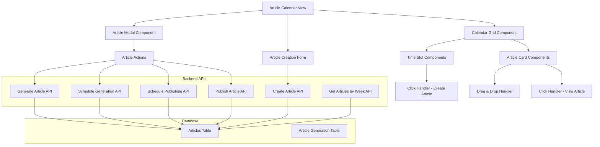

# Design Document

## Overview

This design transforms the current article workflow from a tab-based interface to a unified calendar-based interface similar to the existing Reddit tasks calendar. The calendar will provide a visual, time-based approach to managing article creation, generation scheduling, and publishing, making it easier for users to plan and coordinate their content strategy across time.

The design leverages the existing calendar infrastructure from the Reddit tasks feature while adapting it for article workflow management. This approach ensures consistency in user experience and reuses proven UI patterns.

## Architecture

### High-Level Architecture



### Component Architecture

The calendar interface will be built using a modular component structure:

1. **ArticleCalendarView** - Main container component
2. **CalendarGrid** - Weekly calendar layout
3. **TimeSlot** - Individual time slot components
4. **ArticleCard** - Article representation in calendar
5. **ArticleModal** - Detailed article view and actions
6. **ArticleCreationForm** - New article creation interface

## Components and Interfaces

### ArticleCalendarView Component

```typescript
interface ArticleCalendarViewProps {
  className?: string;
}

interface ArticleCalendarState {
  currentWeek: Date;
  articles: Article[];
  loading: boolean;
  error: string | null;
  selectedArticle: Article | null;
  showArticleModal: boolean;
  showCreationForm: boolean;
  draggedArticle: Article | null;
  dragOverSlot: { day: Date; hour: number; minute: number } | null;
}
```

### CalendarGrid Component

```typescript
interface CalendarGridProps {
  weekStartDate: Date;
  articles: Article[];
  onTimeSlotClick: (day: Date, hour: number, minute: number) => void;
  onArticleClick: (article: Article) => void;
  onArticleDrag: (article: Article, targetSlot: TimeSlot) => void;
  loading?: boolean;
}

interface TimeSlot {
  day: Date;
  hour: number;
  minute: number;
}
```

### ArticleCard Component

```typescript
interface ArticleCardProps {
  article: Article;
  layout: ArticleLayout;
  onClick: (article: Article) => void;
  onDragStart: (e: React.DragEvent, article: Article) => void;
  onDragEnd: () => void;
  isDragging?: boolean;
  isOverlapped?: boolean;
}

interface ArticleLayout {
  top: string;
  left: string;
  width: string;
  height: string;
  zIndex: number;
}
```

### ArticleModal Component

```typescript
interface ArticleModalProps {
  article: Article | null;
  open: boolean;
  onOpenChange: (open: boolean) => void;
  onUpdate: (articleId: string, updates: Partial<Article>) => Promise<void>;
  onDelete: (articleId: string) => Promise<void>;
  onGenerate: (articleId: string) => Promise<void>;
  onScheduleGeneration: (articleId: string, scheduledAt: Date) => Promise<void>;
  onPublish: (articleId: string) => Promise<void>;
  onSchedulePublishing: (articleId: string, scheduledAt: Date) => Promise<void>;
}
```

### ArticleCreationForm Component

```typescript
interface ArticleCreationFormProps {
  open: boolean;
  onOpenChange: (open: boolean) => void;
  initialData?: {
    scheduledDate: string;
    scheduledTime: string;
  };
  onCreateArticle: (data: CreateArticleData) => Promise<void>;
}

interface CreateArticleData {
  title: string;
  keywords?: string[];
  notes?: string;
  targetAudience?: string;
  scheduledDate?: string;
  scheduledTime?: string;
  scheduleType?: 'generation' | 'publishing';
}
```

## Data Models

### Extended Article Interface

The existing Article interface will be extended to support calendar scheduling:

```typescript
export interface Article {
  // Existing fields...
  id: string;
  title: string;
  content?: string;
  status: ArticleStatus;
  projectId: number;
  keywords?: string[];
  notes?: string;
  createdAt: string;
  updatedAt: string;
  
  // Generation scheduling
  generationScheduledAt?: string;
  generationStartedAt?: string;
  generationCompletedAt?: string;
  generationProgress?: number;
  generationPhase?: "research" | "writing" | "validation" | "optimization";
  generationError?: string;
  
  // Publishing scheduling
  publishScheduledAt?: string;
  publishedAt?: string;
  
  // Calendar-specific computed fields
  calendarPosition?: CalendarPosition;
  calendarCategory?: ArticleCalendarCategory;
}

interface CalendarPosition {
  day: Date;
  hour: number;
  minute: number;
  duration: number; // in minutes
}

type ArticleCalendarCategory = 
  | 'idea' 
  | 'scheduled-generation' 
  | 'generating' 
  | 'scheduled-publishing' 
  | 'published'
  | 'failed';
```

### Calendar Layout Data

```typescript
interface WeeklyArticlesData {
  weekStartDate: string;
  articles: Record<string, Article[]>; // key: YYYY-MM-DD, value: articles for that day
}

interface ArticleLayoutMap {
  [articleId: string]: ArticleLayout;
}
```

## API Endpoints

### New API Endpoints

#### GET /api/articles/calendar/week
```typescript
interface WeeklyArticlesRequest {
  weekStartDate: string; // ISO date string
  projectId: number;
}

interface WeeklyArticlesResponse {
  success: boolean;
  data: WeeklyArticlesData;
}
```

#### POST /api/articles/schedule-generation
```typescript
interface ScheduleGenerationRequest {
  articleId: string;
  scheduledAt: string; // ISO datetime string
}

interface ScheduleGenerationResponse {
  success: boolean;
  data: {
    id: string;
    title: string;
    status: string;
    generationScheduledAt: string;
  };
}
```

#### PUT /api/articles/[id]/reschedule
```typescript
interface RescheduleArticleRequest {
  scheduledAt: string; // ISO datetime string
  scheduleType: 'generation' | 'publishing';
}

interface RescheduleArticleResponse {
  success: boolean;
  data: Article;
}
```

### Enhanced Existing Endpoints

The existing article endpoints will be enhanced to support calendar operations:

- **POST /api/articles** - Enhanced to accept scheduling parameters
- **PUT /api/articles/[id]** - Enhanced to support rescheduling
- **GET /api/articles** - Enhanced with week-based filtering

## Calendar Layout Algorithm

### Time Slot Positioning

Articles will be positioned in the calendar using a time-based layout system:

```typescript
function calculateArticlePosition(article: Article): CalendarPosition {
  const scheduledDate = getArticleScheduledDate(article);
  const day = new Date(scheduledDate);
  const hour = day.getHours();
  const minute = day.getMinutes();
  
  return {
    day: startOfDay(day),
    hour,
    minute,
    duration: 60 // Default 1-hour duration
  };
}

function getArticleScheduledDate(article: Article): string {
  // Priority: publishing schedule > generation schedule > creation date
  return article.publishScheduledAt || 
         article.generationScheduledAt || 
         article.createdAt;
}
```

### Overlap Handling

When multiple articles are scheduled for the same time slot:

```typescript
function calculateOverlapLayout(articlesForSlot: Article[]): ArticleLayoutMap {
  const layouts: ArticleLayoutMap = {};
  const columns: Article[][] = [];
  
  // Sort articles by scheduled time, then by ID for stable ordering
  const sortedArticles = articlesForSlot.sort((a, b) => {
    const timeA = new Date(getArticleScheduledDate(a)).getTime();
    const timeB = new Date(getArticleScheduledDate(b)).getTime();
    if (timeA !== timeB) return timeA - timeB;
    return a.id.localeCompare(b.id);
  });
  
  // Assign articles to columns to minimize overlap
  sortedArticles.forEach(article => {
    let placed = false;
    
    for (const column of columns) {
      if (canPlaceInColumn(article, column)) {
        column.push(article);
        placed = true;
        break;
      }
    }
    
    if (!placed) {
      columns.push([article]);
    }
  });
  
  // Calculate layout for each article
  const totalColumns = columns.length;
  columns.forEach((column, columnIndex) => {
    column.forEach(article => {
      layouts[article.id] = {
        top: calculateTopPosition(article),
        left: `${(columnIndex / totalColumns) * 100}%`,
        width: `${(100 / totalColumns) * 1.1}%`, // Slight overlap for visual effect
        height: '48px', // Fixed height for 1-hour slots
        zIndex: 10 + columnIndex
      };
    });
  });
  
  return layouts;
}
```

## Visual Design System

### Article Status Colors

```typescript
const articleStatusColors = {
  idea: {
    background: 'bg-blue-100',
    border: 'border-blue-300',
    text: 'text-blue-800',
    icon: 'text-blue-600'
  },
  'scheduled-generation': {
    background: 'bg-orange-100',
    border: 'border-orange-300',
    text: 'text-orange-800',
    icon: 'text-orange-600'
  },
  generating: {
    background: 'bg-purple-100',
    border: 'border-purple-300',
    text: 'text-purple-800',
    icon: 'text-purple-600'
  },
  'scheduled-publishing': {
    background: 'bg-yellow-100',
    border: 'border-yellow-300',
    text: 'text-yellow-800',
    icon: 'text-yellow-600'
  },
  published: {
    background: 'bg-green-100',
    border: 'border-green-300',
    text: 'text-green-800',
    icon: 'text-green-600'
  },
  failed: {
    background: 'bg-red-100',
    border: 'border-red-300',
    text: 'text-red-800',
    icon: 'text-red-600'
  }
};
```

### Icons and Indicators

```typescript
const articleStatusIcons = {
  idea: Lightbulb,
  'scheduled-generation': Clock,
  generating: Loader2, // with spin animation
  'scheduled-publishing': Calendar,
  published: CheckCircle,
  failed: AlertCircle
};
```

## User Interactions

### Drag and Drop Workflow

1. **Drag Start**: User clicks and drags an article card
2. **Drag Over**: Visual feedback shows valid drop zones
3. **Drop**: Article is moved to new time slot
4. **API Call**: Backend updates article schedule
5. **UI Update**: Calendar refreshes to show new position

### Time Slot Click Workflow

1. **Click**: User clicks on empty time slot
2. **Form Open**: Article creation form opens with pre-filled time
3. **Form Submit**: New article is created with scheduled time
4. **UI Update**: New article appears in calendar

### Article Click Workflow

1. **Click**: User clicks on article card
2. **Modal Open**: Article details modal opens
3. **Actions**: User can perform status-appropriate actions
4. **API Calls**: Backend processes actions
5. **UI Update**: Calendar and modal update to reflect changes

## Error Handling

### Network Errors

```typescript
interface ErrorHandlingStrategy {
  optimisticUpdates: boolean;
  retryAttempts: number;
  fallbackBehavior: 'revert' | 'maintain' | 'refresh';
}

const dragDropErrorHandling: ErrorHandlingStrategy = {
  optimisticUpdates: true,
  retryAttempts: 2,
  fallbackBehavior: 'revert'
};

const articleActionErrorHandling: ErrorHandlingStrategy = {
  optimisticUpdates: false,
  retryAttempts: 1,
  fallbackBehavior: 'refresh'
};
```

### Validation Errors

- **Past Date Scheduling**: Prevent scheduling in the past
- **Conflicting Schedules**: Warn about overlapping schedules
- **Invalid Article States**: Prevent invalid state transitions

## Testing Strategy

### Unit Tests

1. **Calendar Layout Algorithm**: Test overlap handling and positioning
2. **Date Calculations**: Test week navigation and time slot calculations
3. **Article Status Logic**: Test status transitions and validations
4. **Drag and Drop Logic**: Test drag validation and position updates

### Integration Tests

1. **API Integration**: Test all calendar-related API endpoints
2. **Database Operations**: Test article scheduling and updates
3. **Real-time Updates**: Test calendar refresh and synchronization

### End-to-End Tests

1. **Complete Workflows**: Test full article lifecycle in calendar
2. **Multi-user Scenarios**: Test concurrent article management
3. **Cross-browser Compatibility**: Test drag and drop across browsers

## Performance Considerations

### Data Loading

- **Week-based Loading**: Load only articles for current week
- **Lazy Loading**: Load article details on demand
- **Caching**: Cache week data to reduce API calls

### Rendering Optimization

- **Virtual Scrolling**: For large numbers of articles
- **Memoization**: Prevent unnecessary re-renders
- **Debounced Updates**: Batch rapid state changes

### Database Optimization

- **Indexed Queries**: Optimize queries by date ranges
- **Batch Operations**: Group multiple updates
- **Connection Pooling**: Manage database connections efficiently

## Migration Strategy

### Phase 1: Parallel Implementation
- Build calendar view alongside existing workflow
- Add feature flag to toggle between interfaces
- Migrate data structures to support both views

### Phase 2: User Testing
- Enable calendar view for beta users
- Collect feedback and iterate on design
- Ensure feature parity with existing workflow

### Phase 3: Full Migration
- Make calendar view the default interface
- Deprecate old workflow tabs
- Remove legacy code after transition period

## Security Considerations

### Data Access Control
- Verify project ownership for all article operations
- Implement proper user authentication for API endpoints
- Validate all scheduling parameters to prevent manipulation

### Input Validation
- Sanitize all user inputs for article creation
- Validate date ranges and scheduling constraints
- Prevent XSS attacks in article content display

### Rate Limiting
- Implement rate limits for article creation and updates
- Prevent abuse of scheduling APIs
- Monitor for suspicious activity patterns