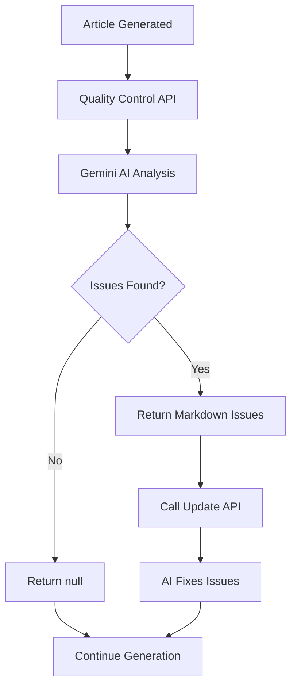

# Article Quality Control System Design

## Overview

The Article Quality Control system is a validation layer that ensures generated articles meet user-defined quality standards before publication. The system integrates seamlessly into the existing article generation pipeline, using Google Gemini AI to analyze articles against user settings and writing prompts, returning markdown-formatted feedback for automatic correction.

## Architecture

### System Integration

The quality control system integrates as a new step in the existing article generation workflow:

```
Article Generation Flow:
1. Generate Ideas
2. Research
3. Write Article
4. **Quality Control Validation** (NEW)
5. Update Article (if issues found)
6. Final Validation
7. Complete Generation
```

### API Endpoint Structure

**New Endpoint:** `POST /api/articles/quality-control`

**Integration Point:** Called from `/api/articles/generate` after the writing step and before completion.

### Data Flow



## Components and Interfaces

### Quality Control API Handler

**File:** `src/app/api/articles/quality-control/route.ts`

**Input Interface:**
```typescript
interface QualityControlRequest {
  articleContent: string;
  userSettings: {
    toneOfVoice?: string;
    articleStructure?: string;
    maxWords?: number;
    faqCount?: number;
    notes?: string;
  };
  originalPrompt: string; // The writing prompt used to generate the article
}
```

**Output Interface:**
```typescript
interface QualityControlResponse {
  issues: string | null; // Markdown-formatted issues or null if no issues
  isValid: boolean; // Quick boolean check
}
```

### AI Analysis Service

**Responsibility:** Interface with Google Gemini to analyze article quality

**Key Functions:**
- Format quality control prompt with article content and user settings
- Send request to Gemini API
- Parse and structure the AI response
- Return formatted markdown issues or null

### Quality Control Prompt

**Location:** Added to `src/prompts.ts`

**Purpose:** Structured prompt that instructs Gemini to:
- Compare article against user settings (tone, structure, word count)
- Validate adherence to original writing prompt
- Check for common quality issues (readability, SEO, structure)
- Return specific, actionable feedback in markdown format

## Data Models

### Quality Control Integration

**Database Schema Update Required:**
- Add `qualityControlReport` field to `articleGeneration` table
- Store quality control response for tracking and debugging

**Schema Addition:**
```typescript
// Add to articleGeneration table in schema.ts
qualityControlReport: text("quality_control_report"), // Store markdown issues or null
```

**Existing Models Used:**
- Article content (string)
- User settings (from existing settings schema)
- Generation metadata (for context)

### Response Format

**Success Response (No Issues):**
```json
{
  "issues": null,
  "isValid": true
}
```

**Success Response (Issues Found):**
```json
{
  "issues": "# Article Quality Issues\n\n## Tone of Voice\n- The article uses overly technical language that doesn't match your 'friendly and approachable' tone setting...",
  "isValid": false
}
```

## Error Handling

### API Error Scenarios

1. **Invalid Input Data**
   - Missing required fields
   - Malformed article content
   - Response: 400 Bad Request with validation errors

2. **AI Service Failures**
   - Gemini API unavailable
   - Rate limiting
   - Response: 500 Internal Server Error, fallback to skip quality control

3. **Processing Errors**
   - Prompt formatting failures
   - Response parsing errors
   - Response: 500 Internal Server Error with error details

### Graceful Degradation

- If quality control fails, the system continues with article generation
- Log errors for monitoring and debugging
- Provide fallback behavior that doesn't block the generation process

## Testing Strategy

### Unit Tests

**Quality Control Handler Tests:**
- Valid input processing
- Error handling for malformed requests
- Response format validation
- Integration with AI service

**AI Service Tests:**
- Prompt formatting accuracy
- Response parsing reliability
- Error handling for API failures
- Mock Gemini responses for consistent testing

### Integration Tests

**End-to-End Generation Flow:**
- Article generation with quality control enabled
- Quality issues detection and correction flow
- Performance impact measurement
- Error recovery scenarios

### Quality Validation Tests

**Prompt Effectiveness:**
- Test with various article types and user settings
- Validate issue detection accuracy
- Ensure actionable feedback quality
- Test markdown formatting consistency

## Implementation Considerations

### Performance

- Quality control adds one additional AI API call to generation process
- Expected impact: 2-5 seconds additional processing time
- Implement timeout handling to prevent generation blocking
- Consider async processing for non-critical validations

### Monitoring

- Track quality control success/failure rates
- Monitor AI response times and costs
- Log common issue patterns for prompt optimization
- Measure impact on overall generation performance

### Scalability

- Use existing AI service infrastructure
- Leverage current rate limiting and retry mechanisms
- No additional database load (processing only)
- Stateless design allows horizontal scaling

### Security

- Validate all input data before processing
- Sanitize article content for AI processing
- Protect user settings and prompt data
- Follow existing authentication patterns