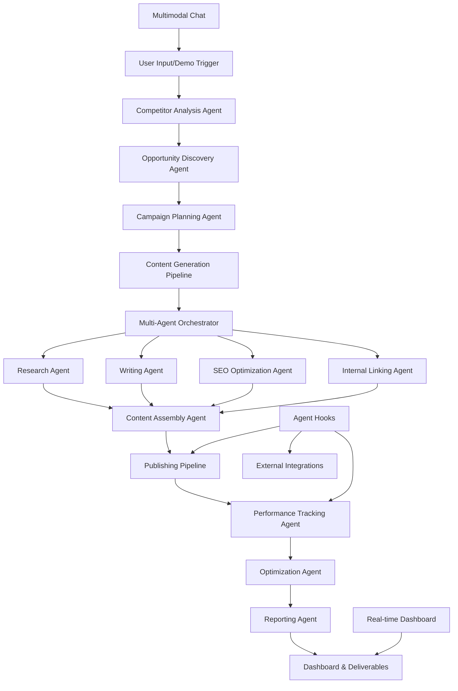

# Design Document

## Overview

The Hackathon SEO Automation enhancement transforms the existing AI SEO Content Machine into a comprehensive, autonomous SEO campaign system that showcases Kiro's full capabilities. This design leverages the current multi-agent architecture while adding real-time performance tracking, competitor analysis, and automated optimization loops.

The system demonstrates three key hackathon winning patterns:
1. **Complete business loop automation**: From opportunity discovery to performance optimization
2. **Deep Kiro integration**: Specs, agent hooks, multimodal chat, and live code generation
3. **Tangible deliverables**: Reports, dashboards, and ready-to-use business assets

## Architecture

### High-Level System Flow



### Core Components Integration

The design extends the existing architecture by adding new API endpoints while preserving the current no-services pattern:

```
src/app/api/
├── hackathon-demo/           # New: Demo orchestration
│   ├── trigger/              # Start full campaign demo
│   ├── status/               # Real-time progress tracking
│   └── results/              # Demo results and deliverables
├── competitor-analysis/      # New: Competitor research
│   ├── analyze/              # Analyze competitor content
│   ├── opportunities/        # Identify content gaps
│   └── trends/               # Track industry trends
├── campaign-orchestration/   # New: Multi-agent coordination
│   ├── create/               # Create campaign from opportunities
│   ├── execute/              # Run multi-agent pipeline
│   └── monitor/              # Track campaign progress
├── performance-tracking/     # New: SEO metrics and optimization
│   ├── rankings/             # Track keyword positions
│   ├── traffic/              # Monitor organic traffic
│   ├── optimize/             # Auto-optimization suggestions
│   └── reports/              # Generate business reports
└── articles/                 # Existing: Enhanced with new features
    ├── [id]/
    │   ├── performance/      # New: Article-specific metrics
    │   └── optimize/         # New: Auto-optimization
    └── batch-operations/     # New: Bulk article operations
```

## Components and Interfaces

### 1. Demo Orchestration System

**Purpose**: Provide a seamless 3-minute demo experience for hackathon judges

**Key Features**:
- One-click campaign trigger with realistic data
- Real-time progress visualization
- Fallback to cached data if APIs fail
- Tangible deliverable generation

**API Interface**:
```typescript
// src/app/api/hackathon-demo/trigger/route.ts
export interface DemoTriggerRequest {
  industry: string;
  targetDomain?: string;
  demoMode: 'live' | 'cached';
}

export interface DemoTriggerResponse {
  campaignId: string;
  estimatedDuration: number;
  progressUrl: string;
  deliverables: {
    dashboard: string;
    reports: string[];
    generatedContent: string[];
  };
}
```

### 2. Competitor Analysis Engine

**Purpose**: Automatically discover SEO opportunities by analyzing competitor content strategies

**Key Features**:
- SERP analysis for target keywords
- Content gap identification
- Trending topic detection
- Difficulty scoring

**Integration Points**:
- Google Search API for SERP data
- Content analysis using existing AI agents
- Opportunity scoring algorithm
- Visual roadmap generation

### 3. Multi-Agent Campaign Orchestrator

**Purpose**: Coordinate multiple AI agents to execute complete SEO campaigns

**Key Features**:
- Agent dependency management
- Parallel processing where possible
- Error handling and retry logic
- Progress tracking and reporting

**Agent Coordination Flow**:
```typescript
interface CampaignExecution {
  phases: {
    research: {
      agents: ['competitor-analysis', 'keyword-research', 'trend-analysis'];
      dependencies: [];
      outputs: ['research-brief', 'keyword-list', 'content-opportunities'];
    };
    content: {
      agents: ['content-writer', 'seo-optimizer', 'internal-linker'];
      dependencies: ['research'];
      outputs: ['articles', 'meta-data', 'internal-links'];
    };
    optimization: {
      agents: ['performance-tracker', 'auto-optimizer'];
      dependencies: ['content'];
      outputs: ['performance-metrics', 'optimization-suggestions'];
    };
  };
}
```

### 4. Real-Time Performance Dashboard

**Purpose**: Provide live SEO metrics and campaign ROI visualization

**Key Features**:
- Real-time ranking tracking
- Traffic projection models
- ROI calculations
- Performance alerts

**Data Sources**:
- Google Search Console API
- Google Analytics API
- Internal article performance tracking
- Ranking position monitoring

### 5. Intelligent Optimization System

**Purpose**: Continuously improve content performance based on data

**Key Features**:
- Automatic content updates
- Internal linking optimization
- Keyword opportunity detection
- Performance-based recommendations

## Data Models

### Campaign Model
```typescript
interface Campaign {
  id: string;
  name: string;
  industry: string;
  targetDomain?: string;
  status: 'planning' | 'executing' | 'optimizing' | 'completed';
  opportunities: Opportunity[];
  articles: Article[];
  performance: CampaignPerformance;
  createdAt: Date;
  completedAt?: Date;
}

interface Opportunity {
  id: string;
  keyword: string;
  difficulty: number;
  trafficPotential: number;
  competitorGap: boolean;
  trending: boolean;
  priority: 'high' | 'medium' | 'low';
}
```

### Performance Tracking Model
```typescript
interface ArticlePerformance {
  articleId: string;
  rankings: KeywordRanking[];
  traffic: TrafficMetrics;
  engagement: EngagementMetrics;
  lastUpdated: Date;
}

interface KeywordRanking {
  keyword: string;
  position: number;
  previousPosition?: number;
  searchVolume: number;
  difficulty: number;
  url: string;
  lastChecked: Date;
}
```

## Error Handling

### Demo Resilience Strategy
1. **API Fallbacks**: Cached realistic data for all external API calls
2. **Progressive Enhancement**: Core demo works even if advanced features fail
3. **Error Masking**: Seamless fallback without exposing technical errors to judges
4. **Performance Monitoring**: Real-time error tracking and automatic recovery

### Production Error Handling
1. **Agent Failure Recovery**: Automatic retry with alternative approaches
2. **Data Validation**: Comprehensive input validation at all API boundaries
3. **Graceful Degradation**: Partial results when some agents fail
4. **User Feedback**: Clear error messages with actionable next steps

## Testing Strategy

### Demo Testing
1. **End-to-End Demo Rehearsal**: Complete 3-minute demo flow testing
2. **Fallback Validation**: Test all cached data scenarios
3. **Performance Testing**: Ensure demo completes within time limits
4. **Cross-Browser Testing**: Verify demo works across different environments

### System Testing
1. **Agent Integration Testing**: Verify multi-agent coordination
2. **API Contract Testing**: Ensure type safety across all endpoints
3. **Performance Testing**: Load testing for concurrent campaign execution
4. **Data Accuracy Testing**: Validate SEO metrics and calculations

### Hackathon-Specific Testing
1. **Judge Experience Testing**: 5-10 external users test the demo flow
2. **Deliverable Quality Testing**: Verify all generated assets are professional
3. **Story Flow Testing**: Ensure demo narrative is compelling and clear
4. **Technical Deep-Dive Testing**: Verify Kiro integration showcase works flawlessly

## Kiro Integration Showcase

### 1. Spec-Driven Development Demo
- Live modification of campaign specs during demo
- Automatic code generation for new agent types
- Real-time architecture diagram updates

### 2. Agent Hooks Implementation
```typescript
// .kiro/hooks/campaign-complete.ts
export const campaignCompleteHook = {
  trigger: 'campaign.completed',
  actions: [
    'deploy-to-vercel',
    'notify-slack',
    'update-analytics',
    'generate-social-posts',
    'schedule-follow-up'
  ]
};
```

### 3. Multimodal Chat Features
- Upload competitor screenshots for visual analysis
- Voice commands for campaign initiation
- Image-based content gap analysis
- Visual content optimization suggestions

### 4. Cross-Platform Integration
- Automatic WordPress/CMS publishing
- Social media post generation and scheduling
- Email newsletter creation
- Slack/Discord notifications

## Performance Considerations

### Scalability Design
1. **Async Agent Processing**: All agents run asynchronously with proper queuing
2. **Caching Strategy**: Aggressive caching of competitor data and SERP results
3. **Database Optimization**: Indexed queries for performance tracking
4. **API Rate Limiting**: Respect external API limits with intelligent queuing

### Demo Performance
1. **Pre-warmed Data**: Critical demo data pre-loaded and cached
2. **Optimistic UI**: Immediate feedback while agents process in background
3. **Progressive Loading**: Show results as they become available
4. **Fallback Speed**: Cached responses return in <100ms

## Security and Privacy

### Data Protection
1. **API Key Management**: Secure storage of all external API credentials
2. **User Data Privacy**: No storage of sensitive competitor information
3. **Rate Limiting**: Prevent abuse of expensive AI operations
4. **Input Validation**: Comprehensive sanitization of all user inputs

### Demo Security
1. **Sandboxed Environment**: Demo runs in isolated environment
2. **Limited Scope**: Demo data doesn't affect production systems
3. **Clean Slate**: Each demo starts with fresh, controlled data
4. **No Persistent Storage**: Demo data automatically cleaned up

## Deployment and Infrastructure

### Hackathon Deployment
1. **Vercel Hosting**: Leverage existing deployment pipeline
2. **Environment Variables**: Secure configuration for all APIs
3. **Database Migrations**: Automated schema updates for new features
4. **CDN Optimization**: Fast global access for judges

### Monitoring and Analytics
1. **Demo Analytics**: Track judge engagement and completion rates
2. **Performance Monitoring**: Real-time system health during demo
3. **Error Tracking**: Comprehensive logging for troubleshooting
4. **Usage Metrics**: Measure system adoption and success rates