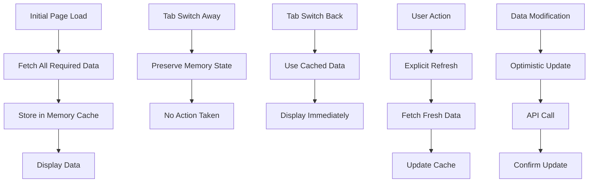

# Design Document

## Overview

This design eliminates automatic data refetching on tab focus/visibility changes by implementing session-based caching, removing problematic event listeners, and ensuring data is only fetched on initial load or explicit user actions. The solution focuses on modifying existing React hooks and context providers to prevent unnecessary API calls.

## Architecture

### Current Problem Areas

1. **OnboardingChecker**: Refetches onboarding status on every mount due to `useEffect` dependencies
2. **ProjectProvider**: Re-initializes projects when `userLoaded` or `user` changes on tab focus
3. **CreditProvider/useCredits**: Fetches credits on every component mount
4. **Tab Visibility Listeners**: Some components may have visibility change listeners

### Solution Architecture



## Components and Interfaces

### 1. Enhanced OnboardingChecker

**Changes:**
- Add session storage for onboarding status
- Only check API once per browser session
- Remove pathname dependency that triggers on navigation

**Interface:**
```typescript
interface OnboardingSession {
  status: boolean | null;
  timestamp: number;
  sessionId: string;
}
```

### 2. Modified ProjectProvider

**Changes:**
- Implement session-based initialization flag
- Remove re-initialization on user state changes
- Add explicit refresh methods only

**Interface:**
```typescript
interface ProjectProviderState {
  isSessionInitialized: boolean;
  lastFetchTimestamp: number;
  sessionId: string;
}
```

### 3. Updated useCredits Hook

**Changes:**
- Add session-based fetch prevention
- Only fetch on mount if not already fetched in session
- Provide explicit refresh method

**Interface:**
```typescript
interface CreditSession {
  credits: number | null;
  lastFetch: number;
  sessionId: string;
}
```

### 4. Session Management Utility

**New utility for managing session state:**
```typescript
interface SessionManager {
  getSessionId(): string;
  isSessionInitialized(key: string): boolean;
  markSessionInitialized(key: string): void;
  clearSession(): void;
}
```

## Data Models

### Session Storage Keys
```typescript
const SESSION_KEYS = {
  ONBOARDING_STATUS: 'contentbot-onboarding-session',
  PROJECTS_INITIALIZED: 'contentbot-projects-session', 
  CREDITS_INITIALIZED: 'contentbot-credits-session',
  SESSION_ID: 'contentbot-session-id'
} as const;
```

### Session Data Structure
```typescript
interface SessionData {
  sessionId: string;
  timestamp: number;
  initialized: boolean;
  data?: unknown;
}
```

## Error Handling

### Session Recovery
- If session data is corrupted, fall back to single fetch
- Clear session data on authentication changes
- Handle session storage unavailability gracefully

### Network Failures
- Maintain existing error handling for initial loads
- Don't retry automatically on tab focus
- Provide user-controlled retry mechanisms

## Testing Strategy

### Unit Tests
- Test session initialization logic
- Verify no refetch on tab focus simulation
- Test explicit refresh functionality
- Validate session data persistence

### Integration Tests  
- Test full dashboard load without tab focus refetches
- Verify data persistence across tab switches
- Test user-initiated refresh flows
- Validate session cleanup on logout

### Manual Testing
- Switch tabs multiple times and verify no network calls
- Test initial page load data fetching
- Verify explicit refresh buttons work
- Test behavior across browser sessions

## Implementation Notes

### Key Changes Required

1. **OnboardingChecker.tsx**
   - Add session storage check before API call
   - Remove pathname from useEffect dependencies
   - Only fetch once per session

2. **ProjectProvider.tsx** 
   - Add session initialization flag
   - Modify useEffect to prevent re-initialization
   - Keep explicit refresh methods

3. **useCredits.ts**
   - Add session-based fetch prevention
   - Only fetch if not fetched in current session
   - Maintain explicit refresh capability

4. **Remove Tab Listeners**
   - Audit and remove any visibility change listeners
   - Remove focus event handlers that trigger fetches
   - Keep only storage event listeners for cross-tab communication

### Backward Compatibility
- All existing explicit refresh functionality remains unchanged
- API endpoints remain the same
- User-initiated actions continue to work as expected
- Only automatic/implicit fetching behavior changes