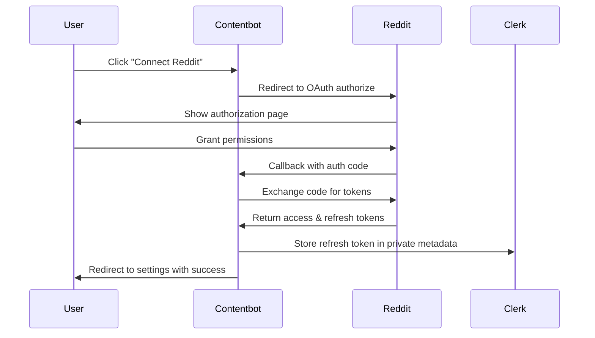
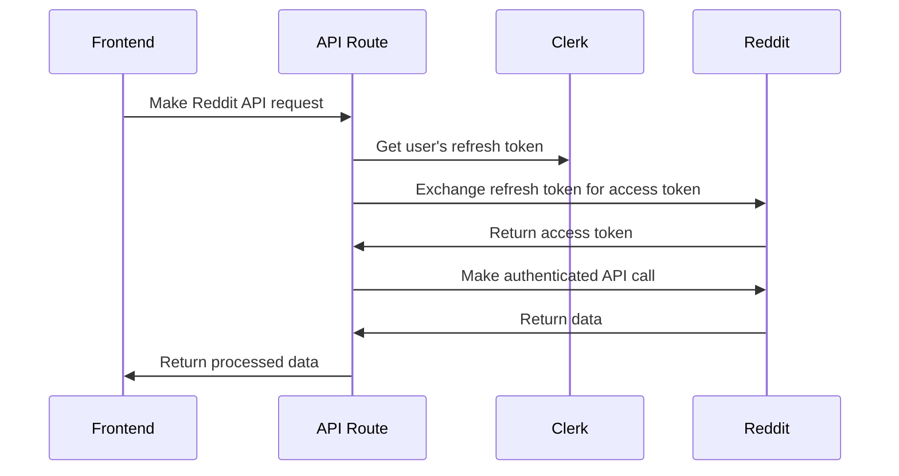

# Design Document

## Overview

The Reddit integration feature will provide a comprehensive interface for users to connect their Reddit accounts and interact with Reddit's API through Contentbot. The integration follows OAuth 2.0 flow for secure authentication and stores refresh tokens in Clerk's private metadata for persistent access.

## Architecture

### Authentication Flow


### API Request Flow


## Components and Interfaces

### API Routes

#### `/api/reddit/auth` (GET)
- **Purpose**: Initiate Reddit OAuth flow
- **Authentication**: Requires Clerk user session
- **Response**: Redirects to Reddit authorization URL
- **Parameters**: None
- **Security**: Generates random state parameter for CSRF protection

#### `/api/reddit/callback` (GET)
- **Purpose**: Handle Reddit OAuth callback
- **Authentication**: Requires Clerk user session
- **Parameters**: `code` (authorization code), `state` (CSRF token)
- **Response**: Redirects to settings page
- **Side Effects**: Stores refresh token in Clerk private metadata

#### `/api/reddit/posts` (POST)
- **Purpose**: Create Reddit posts
- **Authentication**: Requires Clerk user session + Reddit token
- **Request Body**: `{ subreddit: string, title: string, text: string }`
- **Response**: Reddit API response with post details
- **Validation**: All fields required, subreddit format validation

#### `/api/reddit/subreddits` (GET)
- **Purpose**: Search for subreddits
- **Authentication**: Requires Clerk user session + Reddit token
- **Parameters**: `query` (search term)
- **Response**: `{ names: string[] }`
- **Caching**: Consider implementing short-term cache for popular searches

#### `/api/reddit/user` (GET)
- **Purpose**: Get user profile and subscribed subreddits
- **Authentication**: Requires Clerk user session + Reddit token
- **Parameters**: `action` ("profile" | "subreddits")
- **Response**: User profile data or subscribed subreddits list

#### `/api/reddit/subreddit/posts` (GET)
- **Purpose**: Fetch posts from specific subreddit
- **Authentication**: Requires Clerk user session + Reddit token
- **Parameters**: `subreddit` (subreddit name)
- **Response**: Array of post objects with metadata

### Frontend Components

#### `RedditSettingsPage` (`/dashboard/settings/reddit`)
- **Purpose**: Initial connection interface
- **State**: Connection status, loading states
- **Actions**: Initiate OAuth flow
- **UI Elements**: Connect button, status indicators

#### `RedditDashboard` (`/dashboard/reddit`)
- **Purpose**: Main Reddit interaction interface
- **State Management**: 
  - Form data (subreddit, title, text)
  - Search results and loading states
  - User profile and subscriptions
  - Posts data and pagination
- **Components**:
  - Post creation form
  - Subreddit search interface
  - Profile display card
  - Subscribed subreddits list
  - Posts browser with filtering

### Data Models

#### Reddit Token Storage (Clerk Private Metadata)
```typescript
interface RedditTokens {
  redditRefreshToken: string;
  // Optional: store additional metadata
  connectedAt?: string;
  lastUsed?: string;
}
```

#### Reddit API Response Types
```typescript
interface RedditProfile {
  name: string;
  icon_img: string;
  total_karma: number;
  created_utc: number;
}

interface RedditPost {
  data: {
    id: string;
    title: string;
    author: string;
    url: string;
    selftext: string;
    ups: number;
    num_comments: number;
    created_utc: number;
    subreddit: string;
  };
}

interface Subreddit {
  display_name: string;
  display_name_prefixed: string;
  url: string;
  subscribers: number;
  public_description: string;
}
```

## Error Handling

### Token Management
- **Refresh Token Expiry**: Detect expired tokens and prompt re-authentication
- **Invalid Tokens**: Clear stored tokens and redirect to connection flow
- **Rate Limiting**: Implement exponential backoff and user-friendly messages

### API Error Responses
- **400 Bad Request**: Validate input and show specific field errors
- **401 Unauthorized**: Redirect to re-authentication flow
- **403 Forbidden**: Show permissions error with explanation
- **429 Rate Limited**: Display retry-after information
- **500 Server Error**: Log details, show generic error to user

### Network Errors
- **Timeout**: Implement reasonable timeouts (30s) with retry options
- **Connection Failed**: Show network connectivity guidance
- **Partial Failures**: Handle cases where some data loads but others fail

## Testing Strategy

### Unit Tests
- Token refresh logic
- API request/response handling
- Form validation
- Error handling utilities

### Integration Tests
- OAuth flow end-to-end
- API route authentication
- Clerk metadata storage/retrieval
- Reddit API integration

### User Acceptance Tests
- Complete connection flow
- Post creation workflow
- Search functionality
- Error recovery scenarios

### Security Tests
- CSRF protection validation
- Token storage security
- API authentication verification
- Input sanitization

## Performance Considerations

### Caching Strategy
- **Subreddit Search**: Cache popular searches for 5 minutes
- **User Profile**: Cache for 1 hour, refresh on explicit user action
- **Subscribed Subreddits**: Cache for 30 minutes

### Rate Limiting
- **Reddit API Limits**: 60 requests per minute per user
- **Client-side Throttling**: Debounce search inputs (300ms)
- **Retry Logic**: Exponential backoff with jitter

### Loading States
- **Skeleton Loading**: For profile and subreddit lists
- **Progressive Loading**: Load critical data first (profile, then subscriptions)
- **Optimistic Updates**: Show immediate feedback for post creation

## Security Considerations

### OAuth Security
- **State Parameter**: Random 30-character string for CSRF protection
- **Redirect URI Validation**: Strict matching of registered URIs
- **Token Storage**: Encrypted in Clerk's secure metadata store

### API Security
- **Request Validation**: Sanitize all user inputs
- **Rate Limiting**: Implement per-user rate limits
- **Error Information**: Avoid exposing sensitive details in error messages

### Data Privacy
- **Token Scope**: Request minimal necessary permissions
- **Data Retention**: Only store refresh tokens, not access tokens
- **User Control**: Provide disconnect functionality

## Deployment Considerations

### Environment Variables
- `REDDIT_CLIENT_ID`: Reddit application client ID
- `REDDIT_CLIENT_SECRET`: Reddit application client secret
- `NEXT_PUBLIC_APP_URL`: Base URL for OAuth redirects

### Reddit Application Setup
- **Application Type**: Web application
- **Redirect URI**: `{NEXT_PUBLIC_APP_URL}/api/reddit/callback`
- **Permissions**: `identity`, `mysubreddits`, `read`, `submit`
- **User Agent**: `Contentbot/1.0` for API requests

### Monitoring
- **Error Tracking**: Log OAuth failures and API errors
- **Usage Metrics**: Track connection rates and API usage
- **Performance Monitoring**: Monitor API response times and success rates