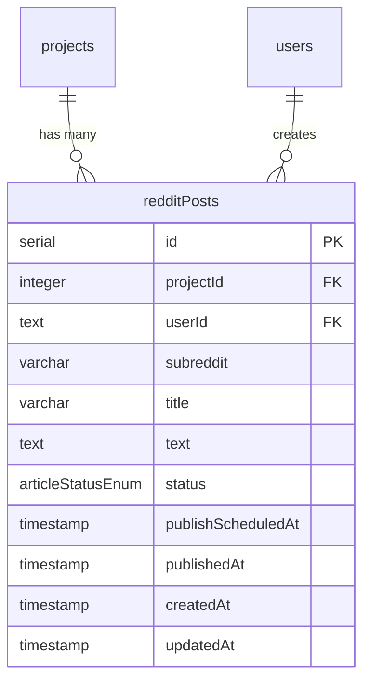
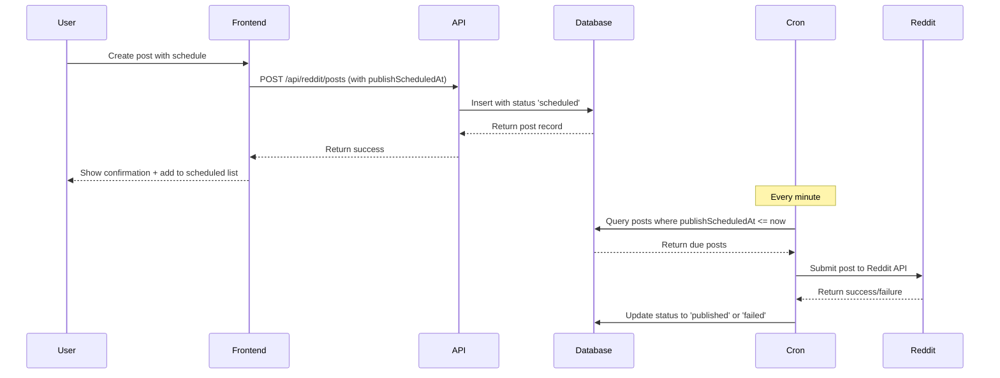
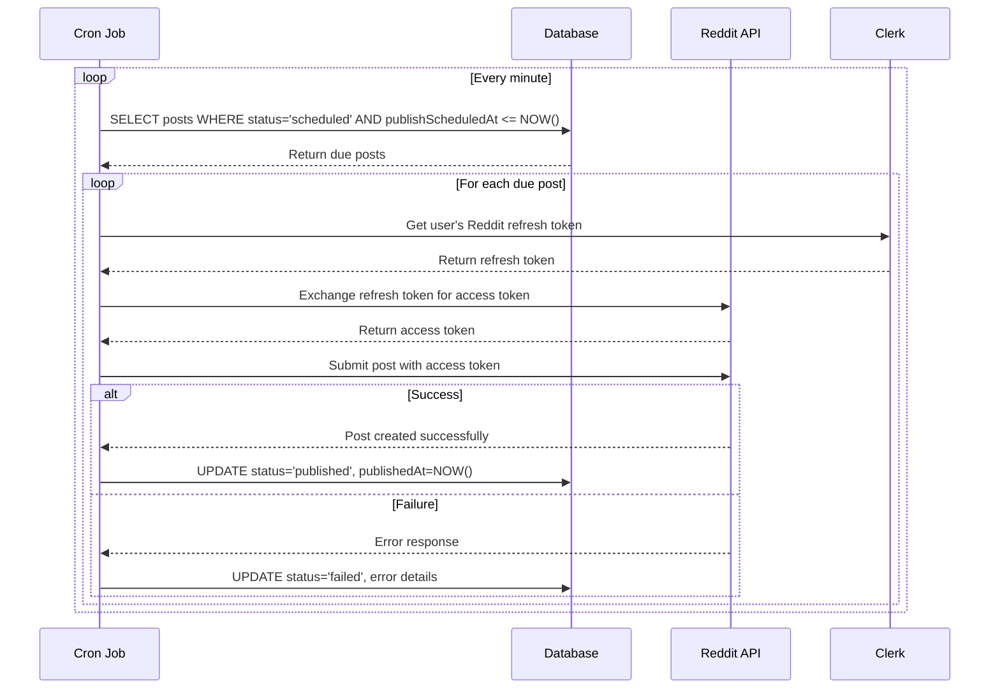

# Design Document

## Overview

The Reddit scheduling feature extends the existing Reddit integration to enable users to schedule posts for future publication. The design follows the established architectural patterns used for article scheduling, ensuring consistency across the platform. The system will store scheduled posts in a dedicated database table, provide an intuitive UI for scheduling and management, and use a cron job for automated publishing.

## Architecture

### Database Schema Integration
The design reuses the existing `articleStatusEnum` to maintain consistency across all content types. This ensures that Reddit posts, articles, and future content types share a unified status system.



### Scheduling Flow


### Publishing Automation Flow


## Components and Interfaces

### Database Schema

#### New Table: `redditPosts`
```typescript
export const redditPosts = contentbotSchema.table("reddit_posts", {
  id: serial("id").primaryKey(),
  projectId: integer("project_id").references(() => projects.id).notNull(),
  userId: text("user_id").references(() => users.id).notNull(),
  subreddit: varchar("subreddit", { length: 255 }).notNull(),
  title: varchar("title", { length: 300 }).notNull(),
  text: text("text").notNull(),
  // Reusing the existing enum for consistency
  status: articleStatusEnum("status").default("idea").notNull(),
  publishScheduledAt: timestamp("publish_scheduled_at", { withTimezone: true }),
  publishedAt: timestamp("published_at", { withTimezone: true }),
  createdAt: timestamp("created_at", { withTimezone: true }).default(sql`CURRENT_TIMESTAMP`).notNull(),
  updatedAt: timestamp("updated_at", { withTimezone: true }).default(sql`CURRENT_TIMESTAMP`).notNull(),
}, (table) => ({
  projectIdIdx: index("reddit_posts_project_id_idx").on(table.projectId),
  statusIdx: index("reddit_posts_status_idx").on(table.status),
  scheduledIdx: index("reddit_posts_scheduled_idx").on(table.publishScheduledAt),
}));
```

### API Routes

#### Modified: `/api/reddit/posts` (POST)
**Purpose**: Handle both immediate and scheduled Reddit post creation
**Request Body**:
```typescript
interface RedditPostRequest {
  subreddit: string;
  title: string;
  text: string;
  projectId: number;
  publishScheduledAt?: string; // ISO date string for scheduling
}
```

**Response**:
```typescript
interface RedditPostResponse {
  success: boolean;
  data?: {
    id: number;
    status: 'scheduled' | 'published';
    publishScheduledAt?: string;
    redditPostId?: string; // Only for immediate posts
  };
  error?: string;
}
```

**Logic Flow**:
1. Validate required fields (subreddit, title, text, projectId)
2. If `publishScheduledAt` is provided:
   - Validate future date
   - Store in `redditPosts` table with status 'scheduled'
   - Return success with scheduled confirmation
3. If no `publishScheduledAt`:
   - Follow existing immediate posting logic
   - Submit to Reddit API immediately
   - Return success with Reddit post ID

#### New: `/api/reddit/posts/[id]` (PUT, DELETE)
**Purpose**: Manage individual scheduled posts

**PUT Method**:
```typescript
interface UpdateRedditPostRequest {
  subreddit?: string;
  title?: string;
  text?: string;
  publishScheduledAt?: string;
}
```

**DELETE Method**:
- Removes scheduled post from database
- Only allows deletion of posts with status 'scheduled'
- Returns confirmation of cancellation

#### New: `/api/reddit/posts/scheduled` (GET)
**Purpose**: Retrieve user's scheduled posts for display
**Query Parameters**: `projectId` (required)
**Response**:
```typescript
interface ScheduledPostsResponse {
  success: boolean;
  data: {
    id: number;
    subreddit: string;
    title: string;
    text: string;
    status: string;
    publishScheduledAt: string;
    createdAt: string;
  }[];
}
```

#### New: `/api/cron/publish-reddit-posts` (POST)
**Purpose**: Automated publishing of scheduled Reddit posts
**Authentication**: Cron job authentication (API key or internal)
**Logic**:
1. Query `redditPosts` for posts with status 'scheduled' and `publishScheduledAt <= NOW()`
2. For each post:
   - Get user's Reddit refresh token from Clerk
   - Exchange for access token
   - Submit post to Reddit API
   - Update status based on result ('published' or 'failed')
3. Handle rate limiting and retry logic
4. Log all operations for monitoring

### Frontend Components

#### Enhanced Reddit Dashboard (`/dashboard/reddit/page.tsx`)

**New State Management**:
```typescript
interface RedditDashboardState {
  // Existing state...
  
  // New scheduling state
  isScheduling: boolean;
  scheduledDate: Date | undefined;
  scheduledPosts: ScheduledPost[];
  loadingScheduled: boolean;
}

interface ScheduledPost {
  id: number;
  subreddit: string;
  title: string;
  text: string;
  status: string;
  publishScheduledAt: string;
  createdAt: string;
}
```

**New UI Components**:

1. **Scheduling Toggle**: Switch between immediate and scheduled posting
2. **DateTimePicker Integration**: Reuse existing component for consistency
3. **Scheduled Posts List**: New card displaying upcoming posts
4. **Post Management Actions**: Edit and delete buttons for scheduled posts

**Layout Enhancement**:
```
┌─────────────────────────────────────────────────────────────────┐
│                    Reddit Dashboard                              │
├─────────────────┬─────────────────┬─────────────────────────────┤
│   Profile &     │   Post Creation │      Scheduled Posts        │
│  Subscriptions  │   & Search      │                             │
│                 │                 │  ┌─────────────────────────┐ │
│  [Profile Card] │  [Create Post]  │  │ Upcoming Posts          │ │
│                 │                 │  │                         │ │
│  [Subscribed    │  [Schedule      │  │ • Post 1 (in 2 hours)  │ │
│   Subreddits]   │   Toggle]       │  │   [Edit] [Delete]       │ │
│                 │                 │  │                         │ │
│                 │  [DateTime      │  │ • Post 2 (tomorrow)     │ │
│                 │   Picker]       │  │   [Edit] [Delete]       │ │
│                 │                 │  │                         │ │
│                 │  [Subreddit     │  └─────────────────────────┘ │
│                 │   Search]       │                             │
└─────────────────┴─────────────────┴─────────────────────────────┘
```

#### Scheduling UI Flow

**Create Post Card Enhancement**:
```typescript
// New toggle for scheduling mode
<div className="flex items-center space-x-2 mb-4">
  <Switch
    checked={isScheduling}
    onCheckedChange={setIsScheduling}
  />
  <Label>Schedule for later</Label>
</div>

// Conditional DateTimePicker
{isScheduling && (
  <div className="mb-4">
    <Label>Publish Date & Time</Label>
    <DateTimePicker
      value={scheduledDate}
      onChange={setScheduledDate}
      minDate={new Date()}
      placeholder="Select date and time"
    />
  </div>
)}

// Dynamic submit button
<Button type="submit" disabled={loading}>
  {loading ? (
    <Loader2 className="h-4 w-4 animate-spin" />
  ) : isScheduling ? (
    "Schedule Post"
  ) : (
    "Submit Post"
  )}
</Button>
```

**Scheduled Posts Card**:
```typescript
<Card className="p-6">
  <h2 className="mb-4 text-lg font-semibold">Scheduled Posts</h2>
  {loadingScheduled ? (
    <div className="flex items-center justify-center py-8">
      <Loader2 className="h-6 w-6 animate-spin" />
    </div>
  ) : scheduledPosts.length > 0 ? (
    <div className="space-y-3">
      {scheduledPosts.map((post) => (
        <ScheduledPostItem
          key={post.id}
          post={post}
          onEdit={handleEditPost}
          onDelete={handleDeletePost}
        />
      ))}
    </div>
  ) : (
    <p className="text-gray-600">No scheduled posts</p>
  )}
</Card>
```

## Data Models

### TypeScript Interfaces

```typescript
// Request/Response types for scheduling
export interface RedditPostSubmissionRequest {
  subreddit: string;
  title: string;
  text: string;
  projectId: number;
  publishScheduledAt?: string; // ISO date string
}

export interface RedditPostSubmissionResponse {
  success: boolean;
  data?: {
    id: number;
    status: 'scheduled' | 'published';
    publishScheduledAt?: string;
    redditPostId?: string;
  };
  error?: string;
}

export interface ScheduledRedditPost {
  id: number;
  projectId: number;
  userId: string;
  subreddit: string;
  title: string;
  text: string;
  status: 'scheduled' | 'published' | 'failed';
  publishScheduledAt: string;
  publishedAt?: string;
  createdAt: string;
  updatedAt: string;
}

export interface UpdateScheduledPostRequest {
  subreddit?: string;
  title?: string;
  text?: string;
  publishScheduledAt?: string;
}

// Cron job types
export interface CronPublishRedditPostsResponse {
  success: boolean;
  data: {
    processed: number;
    published: number;
    failed: number;
    errors: string[];
  };
  message: string;
}
```

## Error Handling

### Validation Errors
- **Past Date Selection**: Prevent scheduling posts for past dates
- **Required Fields**: Validate subreddit, title, and text before scheduling
- **Date Format**: Ensure proper ISO date string format for API calls
- **Project Context**: Validate user has access to the specified project

### API Errors
- **Reddit API Failures**: Handle rate limits, authentication errors, and subreddit restrictions
- **Database Errors**: Handle constraint violations and connection issues
- **Token Refresh Failures**: Gracefully handle expired Reddit tokens during publishing
- **Cron Job Failures**: Log errors and implement retry logic with exponential backoff

### User Experience Errors
- **Network Timeouts**: Show retry options for failed operations
- **Partial Failures**: Handle cases where some scheduled posts publish successfully while others fail
- **Concurrent Edits**: Handle cases where posts are edited while being published

## Testing Strategy

### Unit Tests
- **Date Validation**: Test past date prevention and timezone handling
- **Form Validation**: Test required field validation and error states
- **API Request/Response**: Test proper data transformation and error handling
- **Cron Job Logic**: Test post selection, publishing logic, and status updates

### Integration Tests
- **End-to-End Scheduling**: Test complete flow from form submission to database storage
- **Publishing Automation**: Test cron job execution and Reddit API integration
- **Error Recovery**: Test handling of various failure scenarios
- **Project Isolation**: Test that users can only access their own project's posts

### User Acceptance Tests
- **Scheduling Workflow**: Test complete user journey from creation to publication
- **Management Operations**: Test editing and deleting scheduled posts
- **Status Tracking**: Test real-time status updates and error reporting
- **Cross-Browser Compatibility**: Test DateTimePicker and form interactions

## Performance Considerations

### Database Optimization
- **Indexing Strategy**: Index on `projectId`, `status`, and `publishScheduledAt` for efficient queries
- **Query Optimization**: Use targeted queries to minimize database load
- **Batch Processing**: Process multiple scheduled posts efficiently in cron job

### Caching Strategy
- **Scheduled Posts**: Cache user's scheduled posts for 5 minutes to reduce database queries
- **Reddit Tokens**: Cache access tokens for their lifetime to minimize refresh calls
- **UI State**: Maintain local state for form data to improve user experience

### Rate Limiting
- **Reddit API Limits**: Respect Reddit's rate limits (60 requests per minute per user)
- **Cron Job Throttling**: Process posts with appropriate delays to avoid overwhelming Reddit API
- **User Interface**: Debounce form interactions and provide loading states

## Security Considerations

### Data Protection
- **Input Sanitization**: Sanitize all user inputs before storage and API calls
- **SQL Injection Prevention**: Use parameterized queries for all database operations
- **XSS Prevention**: Properly escape user content in UI components

### Authentication & Authorization
- **Project Isolation**: Ensure users can only access posts from their own projects
- **Reddit Token Security**: Securely handle Reddit tokens during cron job execution
- **API Endpoint Protection**: Validate user permissions for all CRUD operations

### Cron Job Security
- **Internal Authentication**: Secure cron job endpoints from external access
- **Error Information**: Avoid exposing sensitive information in error logs
- **Token Handling**: Securely retrieve and use Reddit tokens during publishing

## Deployment Considerations

### Environment Configuration
- **Cron Job Scheduling**: Configure appropriate cron schedule (every minute recommended)
- **Database Migrations**: Plan migration strategy for new `redditPosts` table
- **Monitoring Setup**: Configure logging and alerting for cron job failures

### Monitoring & Observability
- **Success Metrics**: Track scheduling success rates and publishing success rates
- **Error Tracking**: Monitor and alert on cron job failures and API errors
- **Performance Metrics**: Track database query performance and API response times
- **User Engagement**: Monitor feature adoption and usage patterns

### Scalability Planning
- **Database Growth**: Plan for table growth as users create more scheduled posts
- **Cron Job Performance**: Monitor cron job execution time and optimize as needed
- **Reddit API Scaling**: Plan for increased API usage as feature adoption grows