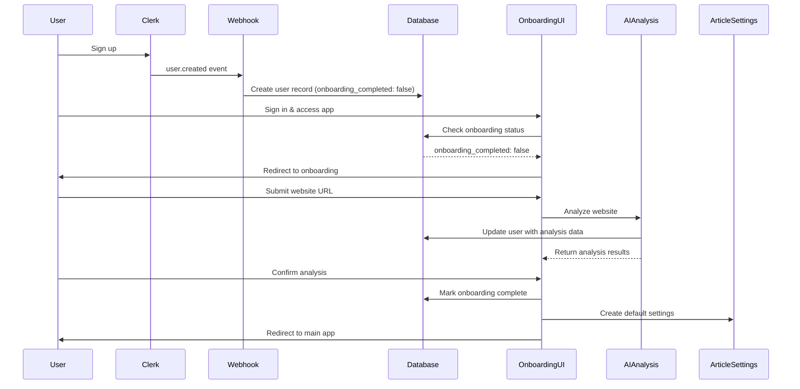

# Design Document

## Overview

The user onboarding feature provides a seamless registration and setup experience for new users of the AI SEO Content Machine. The system consists of three main components: webhook-based user registration, onboarding flow management, and AI-powered website analysis. The design follows the established architecture principles with self-contained API endpoints and colocated types.

## Architecture

### High-Level Flow



### Component Architecture

The system is built using the established no-services architecture with the following components:

1. **Clerk Webhook Handler** - Processes user lifecycle events
2. **Onboarding Status API** - Checks user onboarding completion
3. **Website Analysis API** - AI-powered website content analysis
4. **Onboarding Completion API** - Finalizes onboarding process
5. **Onboarding UI Components** - Multi-step user interface
6. **Middleware Integration** - Handles authentication and routing

## Components and Interfaces

### 1. Clerk Webhook Handler (`/api/webhooks/clerk/route.ts`)

**Purpose**: Process Clerk authentication events and maintain user records

**Current Implementation**: Already exists and handles user.created, user.updated, and user.deleted events

**Required Modifications**: None - the existing implementation already creates users with `onboarding_completed: false`

**Types**:
```typescript
export interface ClerkWebhookResponse {
  success: boolean;
  message?: string;
  error?: string;
}
```

### 2. Onboarding Status API (`/api/onboarding/status/route.ts`)

**Purpose**: Check if user has completed onboarding

**Current Implementation**: Already exists and returns onboarding status

**Required Modifications**: None - existing implementation is sufficient

**Types**:
```typescript
export interface OnboardingStatusResponse {
  success: boolean;
  onboarding_completed: boolean;
  user?: {
    id: string;
    email: string;
    firstName?: string;
    lastName?: string;
  };
  error?: string;
}
```

### 3. Website Analysis API (`/api/onboarding/analyze-website/route.ts`)

**Purpose**: Analyze user's website and extract business information

**Current Implementation**: Already exists with basic scraping and analysis

**Required Enhancements**: 
- Improve AI analysis using actual AI services (Google Gemini or Claude)
- Better error handling for website scraping failures
- Enhanced content extraction and analysis

**Types**:
```typescript
export interface AnalyzeWebsiteRequest {
  websiteUrl: string;
}

export interface AnalyzeWebsiteResponse {
  success: boolean;
  data?: {
    domain: string;
    companyName: string;
    productDescription: string;
    toneOfVoice: string;
    suggestedKeywords: string[];
    industryCategory: string;
    targetAudience: string;
    contentStrategy: {
      articleStructure: string;
      maxWords: number;
      publishingFrequency: string;
    };
  };
  error?: string;
}
```

### 4. Onboarding Completion API (`/api/onboarding/complete/route.ts`)

**Purpose**: Mark onboarding as complete and create default article settings

**Current Implementation**: Exists but only marks onboarding complete

**Required Enhancements**: 
- Create default article settings based on website analysis
- Ensure atomic transaction for both operations

**Types**:
```typescript
export interface CompleteOnboardingResponse {
  success: boolean;
  message?: string;
  error?: string;
}
```

### 5. Onboarding UI Components

**Current Implementation**: Complete multi-step UI already exists

**Components**:
- `OnboardingPage` - Main orchestration component
- `WebsiteUrlForm` - URL input form
- `OnboardingProgress` - Progress indicator
- `AIAnalysisPreview` - Review analysis results

**Required Modifications**: Minor enhancements for better error handling and user experience

### 6. Authentication Middleware (`src/middleware.ts`)

**Current Implementation**: Already handles authentication and allows onboarding routes

**Required Modifications**: None - existing implementation is sufficient

### 7. Onboarding Guard Component

**Purpose**: Redirect users to onboarding if not completed

**Current Implementation**: Logic exists in `OnboardingPage` but needs to be extracted

**Required Enhancement**: Create reusable `OnboardingChecker` component for consistent redirection

## Data Models

### User Schema (Existing)

```typescript
export const users = contentMachineSchema.table("users", {
  id: text("id").primaryKey().default(generatePublicId()),
  clerk_user_id: text("clerk_user_id").unique().notNull(),
  email: text("email").notNull(),
  firstName: text("first_name"),
  lastName: text("last_name"),
  company_name: text("company_name"),
  domain: text("domain"),
  product_description: text("product_description"),
  keywords: jsonb("keywords"),
  onboarding_completed: boolean("onboarding_completed").default(false).notNull(),
  // ... timestamps
});
```

### Article Settings Schema (Existing)

```typescript
export const articleSettings = contentMachineSchema.table("article_settings", {
  id: serial("id").primaryKey(),
  user_id: text("user_id").references(() => users.id),
  toneOfVoice: text("tone_of_voice"),
  articleStructure: text("article_structure"),
  maxWords: integer("max_words").default(800),
  // ... timestamps
});
```

## Error Handling

### Webhook Error Handling

1. **Missing Headers**: Return 400 with descriptive error
2. **Signature Verification**: Return 400 with security error
3. **Database Errors**: Return 500 with logged error details
4. **Duplicate User Creation**: Handle gracefully with upsert logic

### Website Analysis Error Handling

1. **Invalid URL**: Return 400 with validation error
2. **Website Unreachable**: Return 500 with fallback options
3. **AI Analysis Failure**: Provide default analysis results
4. **Timeout Errors**: Implement retry logic with exponential backoff

### Onboarding Flow Error Handling

1. **Authentication Errors**: Redirect to sign-in
2. **Network Errors**: Show retry options with user-friendly messages
3. **Partial Completion**: Allow resuming from last successful step
4. **Database Errors**: Provide fallback options and error recovery

## Testing Strategy

### Unit Tests

1. **Webhook Handler Tests**
   - Test user creation with valid data
   - Test signature verification
   - Test error scenarios (missing data, invalid signatures)
   - Test user update and deletion events

2. **Website Analysis Tests**
   - Test URL validation
   - Test website scraping with mock responses
   - Test AI analysis with sample content
   - Test error handling for unreachable websites

3. **Onboarding API Tests**
   - Test status checking for different user states
   - Test completion flow with database updates
   - Test authentication requirements
   - Test error scenarios

### Integration Tests

1. **End-to-End Onboarding Flow**
   - Test complete user journey from signup to completion
   - Test onboarding redirection logic
   - Test website analysis integration
   - Test article settings creation

2. **Webhook Integration**
   - Test webhook processing with Clerk test events
   - Test database consistency after webhook processing
   - Test error recovery and retry logic

### Component Tests

1. **Onboarding UI Components**
   - Test form validation and submission
   - Test progress indicator updates
   - Test error state handling
   - Test responsive design and accessibility

2. **Onboarding Guard**
   - Test redirection logic for incomplete onboarding
   - Test bypass logic for completed onboarding
   - Test authentication integration

## Implementation Considerations

### AI Integration Enhancement

The current website analysis uses basic heuristics. For production, integrate with actual AI services:

```typescript
// Enhanced AI analysis using Google Gemini
async function analyzeWebsiteWithAI(content: WebsiteContent) {
  const prompt = `Analyze this website content and extract:
  - Company name and product description
  - Industry category and target audience
  - Suggested keywords for content marketing
  - Appropriate tone of voice
  - Content strategy recommendations
  
  Website: ${content.url}
  Title: ${content.title}
  Description: ${content.description}
  Content: ${content.textContent}`;
  
  // Use Google Gemini or Claude for analysis
  const analysis = await generateContent(prompt);
  return parseAnalysisResponse(analysis);
}
```

### Database Transaction Safety

Ensure atomic operations for critical flows:

```typescript
// Atomic onboarding completion
await db.transaction(async (tx) => {
  // Mark onboarding complete
  await tx.update(users)
    .set({ onboarding_completed: true })
    .where(eq(users.clerk_user_id, userId));
  
  // Create article settings
  await tx.insert(articleSettings)
    .values({
      user_id: userRecord.id,
      toneOfVoice: analysisData.toneOfVoice,
      articleStructure: analysisData.contentStrategy.articleStructure,
      maxWords: analysisData.contentStrategy.maxWords,
    });
});
```

### Performance Optimizations

1. **Website Scraping**: Implement timeout and content size limits
2. **AI Analysis**: Cache results for similar websites
3. **Database Queries**: Use appropriate indexes for onboarding status checks
4. **UI Loading States**: Provide immediate feedback for long-running operations

### Security Considerations

1. **Webhook Security**: Verify all Clerk webhook signatures
2. **URL Validation**: Sanitize and validate all user-provided URLs
3. **Rate Limiting**: Implement rate limits for website analysis requests
4. **Data Privacy**: Ensure website content is not stored permanently

### Accessibility and UX

1. **Progressive Enhancement**: Ensure onboarding works without JavaScript
2. **Mobile Responsiveness**: Optimize for mobile device usage
3. **Loading States**: Provide clear feedback during AI analysis
4. **Error Recovery**: Allow users to retry failed operations
5. **Skip Options**: Provide fallback for users without websites