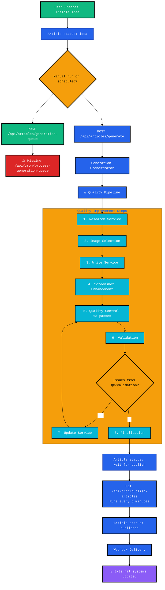
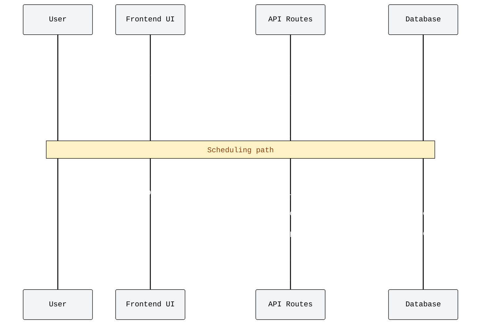
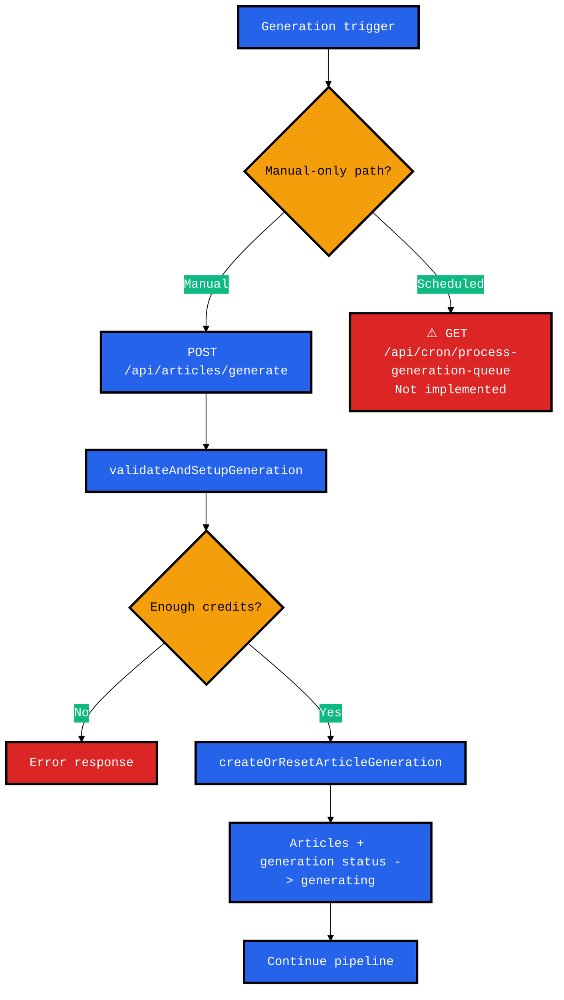
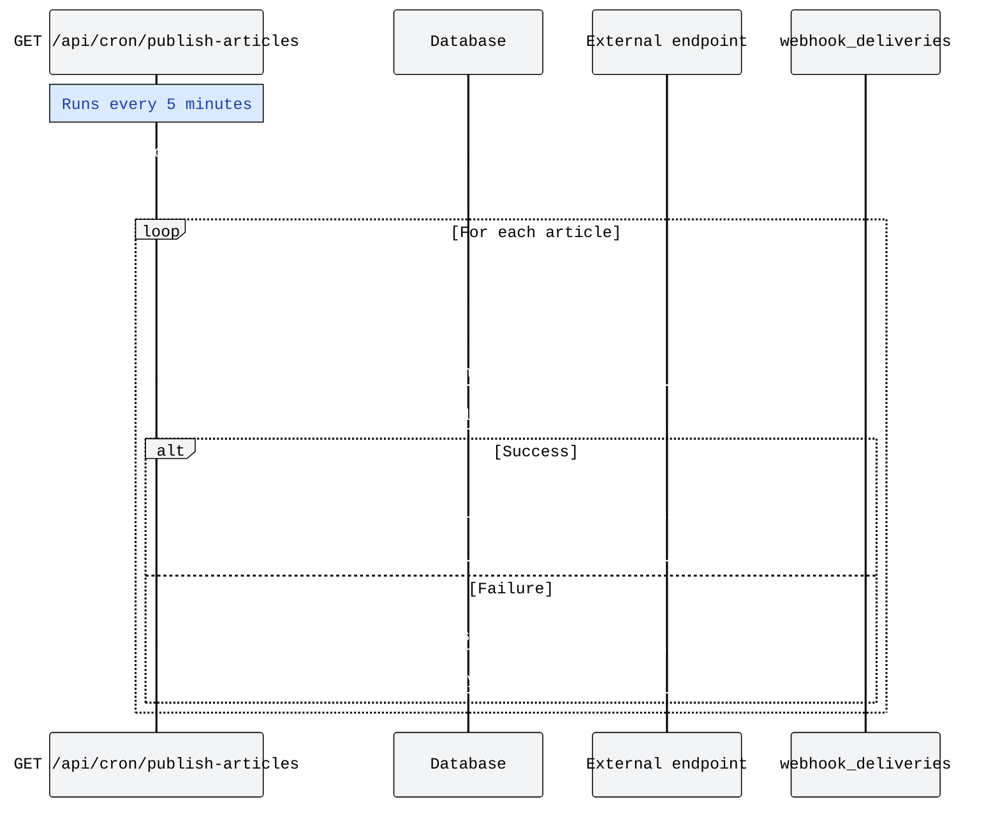
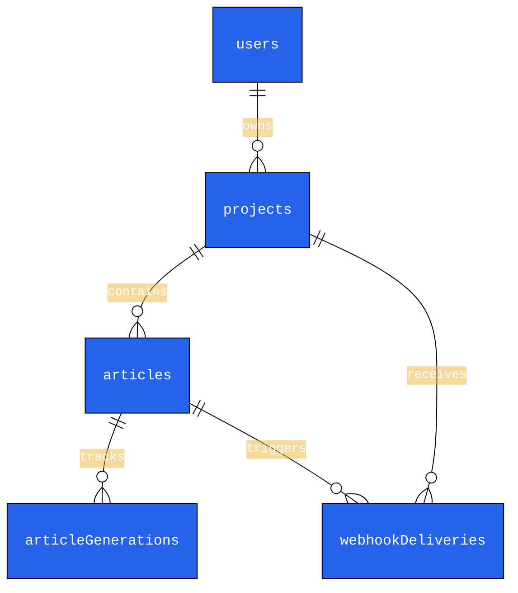
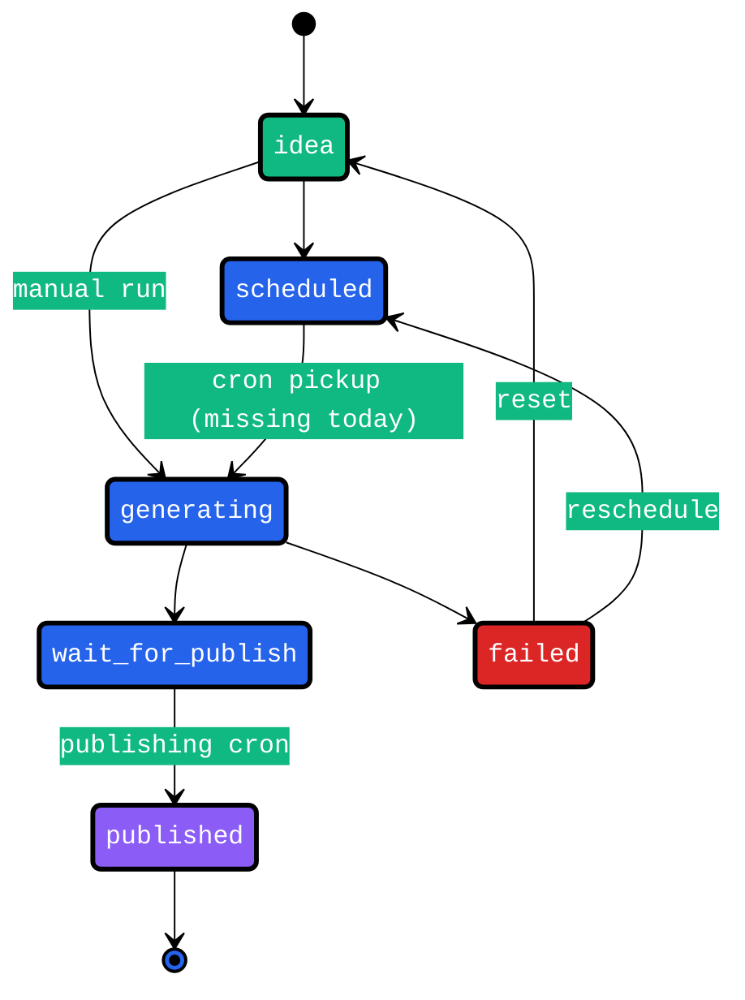

# Article Generation Flow

Simple overview of how articles are generated in Topicowl.

## Article Generation Steps

### 1. Article Creation
- User creates article with status `idea`
- Article stored in `articles` table

### 2. Generation Trigger
**Manual Generation:**
- User clicks generate → `POST /api/articles/generate`
- ✅ Works

**Scheduled Generation:**  
- User schedules → `POST /api/articles/generation-queue`
- ❌ **BROKEN**: `/api/cron/process-generation-queue` doesn't exist
- Scheduled articles never auto-start

### 3. Generation Pipeline (8 Steps)

**Step 1: Research**
- File: `research.ts`
- Status: `research` 
- Action: Gather content data via external APIs
- Artifacts: Research data stored in DB

**Step 2: Image Selection**
- File: `image-selection.ts`
- Status: `image`
- Action: Get images from Unsplash/Pexels APIs
- Artifacts: Cover image + gallery images

**Step 3: Writing**
- File: `writing.ts` 
- Status: `writing`
- Action: AI generates article content
- Artifacts: Title, content, excerpt, meta data

**Step 4: Screenshots**
- File: `screenshots.ts`
- Status: `writing`
- Action: Capture website screenshots
- Artifacts: Screenshot images

**Step 5: Quality Control**
- File: `quality-control.ts` + `quality-control-service.ts`
- Status: `quality-control`
- Action: Review content quality (max 3 times)
- Artifacts: Quality issues & suggestions

**Step 6: Validation** 
- File: `finalization.ts` → `validateArticle()`
- Status: `validating`
- Action: Check SEO & compliance
- Artifacts: Validation results

**Step 7: Update (if issues found)**
- File: `update-service.ts`
- Status: `updating`
- Action: Fix quality/validation issues
- Loop: Goes back to Step 5 (Quality Control)

**Step 8: Finalization**
- File: `finalization.ts`
- Status: `completed` 
- Action: Assemble final content, deduct credits
- Result: Article status → `wait_for_publish`

### 4. Publishing
- Cron job: `/api/cron/publish-articles` (runs every 5 minutes)
- ✅ Works
- Changes status: `wait_for_publish` → `published`

### 5. Webhook Delivery
- Sends article data to external systems
- Tracked in `webhook_deliveries` table
- Retries up to 3 times if fails

## Data Storage

**Articles Table:**
- Main article data
- Status tracking (`idea` → `generating` → `wait_for_publish` → `published`)

**Article Generations Table:**
- Generation progress and artifacts
- All service outputs stored as JSON

**Webhook Deliveries Table:**
- Delivery attempts and status
- Retry logic and timestamps

## API Routes

| Route | Method | Purpose | Status |
|-------|--------|---------|---------|
| `/api/articles/generate` | POST | Manual generation | ✅ Works |
| `/api/articles/generation-queue` | POST | Schedule generation | ✅ Works |
| `/api/cron/process-generation-queue` | GET | Auto-start scheduled | ❌ Missing |
| `/api/cron/publish-articles` | GET | Publish ready articles | ✅ Works |

## Key Files

**Orchestrator:**
- `index.ts` - Main generation logic
- `validation.ts` - Auth & credit checks  
- `utils.ts` - Artifact storage

**Services:**
- `research.ts` - Content research
- `image-selection.ts` - Image curation
- `writing.ts` - AI content generation
- `screenshots.ts` - Screenshot capture
- `quality-control.ts` - Content review wrapper
- `finalization.ts` - Validation & final assembly
- `update-service.ts` - Apply fixes

## Status Flow

```
idea → scheduled (broken) → generating → wait_for_publish → published
  ↓                           ↓               ↓
manual generation           failed        webhook delivery
```

## Critical Issues

1. **Scheduled Generation Broken**: Missing cron job means scheduled articles never start
2. **Quality Control Limit**: Max 3 quality control passes to prevent infinite loops
3. **Credit Deduction**: Only happens at finalization stepicle Generation Flow Diagram

This document outlines the complete Topicowl article generation workflowfrom idea creation to publishingand the services, API routes, and guardrails involved at each step.

## High-Level Architecture Overview



> **Critical note:** `vercel.json` declares `/api/cron/process-generation-queue`, but the route has no implementation. Scheduled articles therefore never auto-start; only manual generation works today.

## Detailed Generation Pipeline

### Phase 1 — Article Creation & Scheduling



### Phase 2 — Orchestrator Trigger



### Phase 3 — Quality Enhancement Pipeline

```mermaid
%%{init: {'theme':'base', 'themeVariables': {'primaryColor':'#2563eb','primaryTextColor':'#ffffff','primaryBorderColor':'#000000','lineColor':'#000000','sectionBkgColor':'#f3f4f6','altSectionBkgColor':'#e5e7eb','gridColor':'#000000','secondaryColor':'#10b981','tertiaryColor':'#f59e0b','edgeLabelBackground':'#ffffff','fontFamily':'monospace'}}}%%
graph TD
    START[Generation begins] --> STEP1

    subgraph "Quality Enhancement Pipeline"
        STEP1[1. research.ts<br/>Status: research<br/>Artifacts: research]
        STEP2[2. image-selection.ts<br/>Status: image<br/>Artifacts: coverImage]
        STEP3[3. writing.ts<br/>Status: writing<br/>Artifacts: write]
        STEP4[4. screenshots.ts<br/>Status: writing<br/>Artifacts: screenshots, usage stats]
        STEP5[5. quality-control.ts/service<br/>Status: quality-control<br/>Guardrail: applyQualityControlWithLimit (≤3 runs)]
        STEP6[6. finalization.ts → validateArticle()<br/>Status: validating]
        STEP7[7. update-service.ts<br/>Status: updating<br/>Applies QC/validation fixes]
        STEP8[8. finalization.ts<br/>Status: completed<br/>Sets article wait_for_publish]
        IssueCheck{Issues from QC or validation?}

        STEP1 --> STEP2 --> STEP3 --> STEP4 --> STEP5 --> STEP6 --> IssueCheck
        IssueCheck -->|Yes| STEP7 --> STEP5
        IssueCheck -->|No| STEP8
    end

    STEP8 --> READY[Article status: wait_for_publish]

    classDef research fill:#06b6d4,stroke:#000000,stroke-width:2px,color:#ffffff
    classDef content fill:#10b981,stroke:#000000,stroke-width:2px,color:#ffffff
    classDef quality fill:#f59e0b,stroke:#000000,stroke-width:2px,color:#000000
    classDef final fill:#8b5cf6,stroke:#000000,stroke-width:2px,color:#ffffff
    classDef decision fill:#ef4444,stroke:#000000,stroke-width:3px,color:#ffffff

    class STEP1,STEP2 research
    class STEP3,STEP4 content
    class STEP5,STEP6,STEP7 quality
    class STEP8 final
    class IssueCheck decision

    subgraph "Artifacts storage"
        ART[(article_generations.artifacts)]
        STEP1 -.-> ART
        STEP2 -.-> ART
        STEP3 -.-> ART
        STEP4 -.-> ART
        STEP5 -.-> ART
        STEP6 -.-> ART
        STEP7 -.-> ART
    end

    classDef storage fill:#22c55e,stroke:#000000,stroke-width:3px,color:#ffffff
    class ART storage
```

### Phase 4 — Publishing & Webhooks



## Data Model



## Generation Components & Entry Points

### Core Orchestrator (`src/lib/services/generation-orchestrator/`)

- `index.ts` — `generateArticle`, `continueGenerationFromPhase`, pipeline orchestration.
- `validation.ts` — validation/authentication helpers and credit checks.
- `utils.ts` — artifact persistence, progress updates, error handling.

### Phase Services

- `research.ts` → content research (sync/async).
- `image-selection.ts` → cover image selection (Unsplash/Pexels).
- `writing.ts` → AI writing with project settings.
- `screenshots.ts` → contextual screenshot enrichment.
- `quality-control.ts` → orchestrator wrapper around `quality-control-service` with run limits.
- `finalization.ts` → validation + final persistence/credit deduction.
- `update-service.ts` (imported) → applies QC/validation fixes.

### API Routes

- `POST /api/articles/generate` — manual trigger (uses orchestrator directly).
- `GET /api/articles/[id]/generation-status` — fetch generation progress.
- `POST /api/articles/generation-queue` — schedule generation.
- `GET /api/cron/publish-articles` — publishing cron (implemented).
- `GET /api/cron/process-generation-queue` — **missing** (declared in `vercel.json`, but no route handler).

## Quality Control Guardrails

- `src/prompts/quality-control.ts` now focuses on three dimensions (writing quality, structure, requirements) and returns at most eight actionable issues.
- `applyQualityControlWithLimit` in `index.ts` caps total QC passes at three per article and records run count/report in `article_generations.artifacts`.
- When QC or validation finds issues, the orchestrator runs the update service, re-runs QC (respecting the cap), and re-validates only if validation previously failed.

## Error Handling Highlights

- Orchestrator sets `articles.status` to `failed` and logs errors when any phase throws.
- Validation/quality errors trigger update attempts automatically before finalising.
- Webhook delivery retries (max three) with exponential backoff via `webhook_deliveries` records.

## Status Flow Summary



## Developer Notes

1. **Add a New Phase**
   - Implement service inside `generation-orchestrator/`.
   - Extend `articleGenerations.status` enum + artifacts types.
   - Insert phase into `continueGenerationPipeline` in `index.ts`.

2. **Implement Missing Queue Cron**
   - Create `/api/cron/process-generation-queue/route.ts`.
   - Authenticate, claim eligible scheduled articles, call `generateArticle`.

3. **Credit Consumption**
   - Credit deduction happens during finalisation (`finalization.ts`).
   - Required credits validated before orchestration (`validation.ts`).

This diagram now mirrors the active code paths, highlights the new quality-control safeguards, and documents the outstanding gap in scheduled generation.
